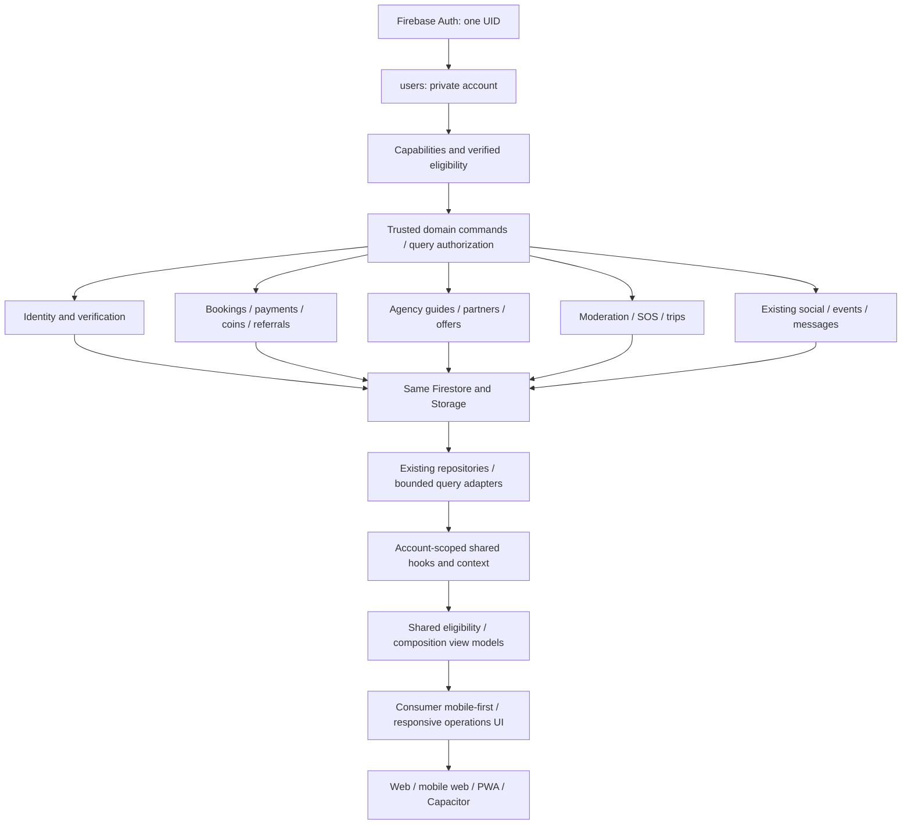

# SATHI target architecture — decision baseline

Date: 2026-09-09. Source inspected: `5ecc696` (clean tree at start). **DESIGN/HANDOFF ONLY; not an implementation or release certificate.** Owner review of this package precedes implementation. No application code, rules, indexes, production records or deployments changed in this architecture session.

> Phase 0 follow-up, 2026-09-10: [PHASE_00_COMPATIBILITY_REPORT.md](PHASE_00_COMPATIBILITY_REPORT.md) now contains fresh rule hashes, billing/handler/index metadata, redacted schema samples, live public query results and captured-production emulator diagnostics. It confirms serious retained authorization bypasses and current booking/Event compatibility gaps. Billing is enabled, but no implementation/deployment approval is inferred. Treat dated unknowns below as historical where that report provides newer evidence.

## Authority and reading order

SATHI connects people, places and experiences across Nepal. It is not a dating application. Nepal-wide data architecture, Pokhara-first commercial operations; NPR only.

For the new ecosystem, this package (20–32 plus ANTIGRAVITY_HANDOFF) supersedes conflicting *target* statements in the August 00–16 documents. It does not overwrite historical evidence or claim deployed behavior. The existing audit quartet is the September 5 snapshot, not today's implementation. CHANGELOG and dated release artifacts explain changes since then. Current source determines local behavior; captured active rules determine deployed permissions. Any unresolved conflict is a Phase 0 blocker, not permission to choose whichever rules pass a test.

Read this file, [roles](21_ROLE_CAPABILITY_MATRIX.md), [data contracts](31_DATA_CONTRACTS.md), then the domain and [phase](30_IMPLEMENTATION_ROADMAP.md) being implemented. The short [handoff](ANTIGRAVITY_HANDOFF.md) is the entry point; old documents remain searchable history.

## Current architecture, evidence and preservation

S = inspected source; H = dated previous verification; V = observed during this documentation pass; U = not independently verified. A working helper is not a working commercial workflow.

| Area | Evidence / actual state | Preserve / extend |
|---|---|---|
| Stack | S: root/admin package.json: React 19, Vite 6, TS, Tailwind 4, Router 7, Firebase Web 12; Functions Admin SDK/Functions v2 plus legacy v1 Auth; Capacitor 8 | Keep stack, project hamrosathi1, existing npm lockfiles and separate admin build. No infrastructure rewrite. |
| Auth/profile | S: `services/auth.ts`, `profileBootstrap.ts`, `identity.ts`, `context/AppContext.tsx`; transactional create-if-absent and account-generation guard | Retain UID/bootstrap. Main firebase.ts still has fallbacks, nullable initialization and first-app reuse: strict project validation is not established despite AGENTS wording. |
| Roles/KYC | S: `CompanionApplicationRepository.review` sequential application/user/companion/audit writes; approval stores categories while feed uses interests; legacy guideApplications remains in standalone AdminRepository | Reuse companion_applications. Make activation atomic, map interests explicitly, never infer verified credentials from legacy isVerified. |
| Booking | S: `bookingTransactions.ts`, `bookingPolicy.json/ts`, BookingRepository; actual atomic day lock plus booking, idempotent ID, policyVersion=2. Minimum rate 500; quote formula rate × hours × (110 + 33 × extra participants) paisa | Reuse unpaid reservation foundation. Do not apply old rate validator to NPR 0 Free Friends. Serverize authority before expanding commerce. No interval/automatic expiry promise today. |
| Payments/wallet | S: payments.ts returns unavailable/unverified; wallet/partner metrics explicitly unavailable | Do not re-enable browser checkout. No authoritative wallet, settlement or referral system found. |
| Home | S: shared useFirestoreData/useVisibleStories → useDiscoveryFeed → feedGenerator/stabilizer → useProgressiveReveal. Desktop `companionRows.ts` additionally fills/reorders real matching profiles; mobile remains sequential | Preserve cards/data. Current desktop and mobile no longer have identical composed sequences. Move category-row selection into shared composition in Phase 2; CSS alone chooses arrangement. |
| Social/media | S: SocialRepository, usePostComments, commentContract, mediaUploadCore, contentInteractions, StoryLikeSurface | Preserve real posts, latest-50 comments, media ownership, double-tap Story likes; **no Story comments**. H: Sept 9 comment rules/index/date repair, guest reads successful; signed-in production posting still U. |
| Events | S: eventParticipationCore uses exact event/member transaction; spots/count/version; tombstone deletion. H: local emulator race tests | Pending Event rules not released in last captured production snapshot. Do not certify new joining/create payload against old live rules. |
| Messaging | S: messaging.ts + MessagesTab; top-level messages, private peer user fetch attempts, unbounded selected-thread listener, client-only two-inquiry limit, typing helper uses document subscription on collection path | Preserve conversation IDs/history; backend entitlement/contact moderation and bounded history needed. Never make private users public to fix peer names. |
| Reviews | S: reviews.ts writes embedded companion reviews, while Functions watches top-level reviews; root rules deny reviews writes | Canonical top-level reviews, transaction-linked eligibility; no second review system. |
| Safety | S: sos.ts/SafetyWidget record one location; locationTracking.ts utility not an integrated active-trip product; Android manifest only INTERNET | Preserve SOS records/copy. Tracking and staffed dispatch are not working capabilities. |
| Admin | S: standalone admin has 11 roles, pages, audit, localStorage rate/idempotency, flawed data-object cursor and swallowed reads; main `/admin/applications` also exists | Reuse screens/role vocabulary; one trusted privileged command contract, not another admin. Browser throttling/idempotency are UX only. |
| Backend | S: mediaSocial.ts has replay-aware receipts/cleanup. Legacy index.ts overwrites profile, replaces claims, sets payment pending, watches obsolete nested messages, aggregates without receipts | Preserve seven released media functions; quarantine legacy exports from deploy until reviewed. H: MEDIA_SOCIAL_RELEASE_RESULT reports seven ACTIVE; not a current billing/entitlement inventory. |
| UI/platform | V: public guest desktop renders sidebar/search/Stories/mixed cards/utility rail; dark gold theme. S: light CSS is navy/gold/white, not old Facebook blue. Native wrappers and generated PWA exist | Preserve visual language; see 29/32. Observed public UI is not proof of latest commit delivery; physical devices, authenticated flows and installed PWA upgrade U. |

### Production/security version boundary — P0

Latest preserved Firestore source: `rollbacks/comments-repair-2026-09-09/candidate.rules`, with `deployed.json`/manifest. Its baseline retains broad legacy isAdmin, authenticated conversation/favorites write clauses and permissive non-media branches. The comments repair deliberately did not change them. Root firestore.rules has stricter P0 contracts but also two overlapping comments matches and an impossible Story-like comparison of getAfter to itself +/−1. It is NOT a deployable replacement for the media release. Scoped `ops/media-rollout/firestore.rules` additionally contains unreleased Events changes. Storage production-derived candidate permits avatars/Stories/Events; **KYC/posts/private remain denied**, unlike root Storage. Thus private KYC uploads are locally designed, not production-enabled.

Phase 0 must fetch exact active releases again, compare source hashes, inventory roles/legacy ownership without downloading KYC contents, and produce per-domain candidate gates. Do not execute repair-comments.mjs again as a generic deploy tool: it is baseline-specific migration history. Never deploy all Functions from index.ts or all root rules blindly. Do not change CORS or App Check enforcement as an architecture task.

## Target dependency boundary

One Firebase-based modular application backend, not microservices. Extend `functions/src/domains/<domain>/`, use explicit dependencies like existing media/booking cores. Add pure shared DTO/enum/validation contracts under `shared/contracts/` only when a second runtime actually consumes them. No SDK initialization in shared code. Frontend `src/services/` binds Firebase clients, repositories compose operations, hooks own subscriptions, components render/call actions. Existing exceptions migrate feature-by-feature, not a wholesale ClientApp rewrite. Admin/agency/partner receive backend-authorized views, not private consumer context.

### Identity and eligibility

One Firebase UID is the account identity, not proof of one real human. Verified uniqueness claims improve duplicate detection; false-positive resolution requires staff. Keep role (system access), capability (service provision), verification (evidence), commercial affiliation and current action eligibility separate. See 21 and 22. Guests can browse general content; backend denies adult interactions unless adult eligibility verified, phone verified where required, account active, capability approved and resource policy satisfied. Missing/expired/unknown evidence fails closed for the protected action, not for ordinary account access.

### Shared command contract

Authenticated commands accept `{requestId, expectedVersion?, ...intent}`. Backend derives UID and current permissions, validates schema/flags/resource ownership, reads authoritative price/config, transacts domain state + immutable audit + idempotency receipt, then performs retryable external effects. Same key+same normalized intent returns original result; different intent returns CONFLICT. Timeout means UNKNOWN: query status using same key, never mint a second monetary action. Transaction callbacks contain no provider calls, emails or notifications to external networks. Existing media receipts remain independent and reused for their existing purpose.

No client-authoritative age, badges, agency approval, wallet balance, payment, QR confirmation, reward or moderation decisions. Server SDK bypasses Firestore rules, so server authorization and IAM are mandatory in addition to rules. Rules evaluate a query's possible results, not filter returned rows. [Firebase server/rules boundary](https://firebase.google.com/docs/firestore/security/insecure-rules), [query authorization](https://firebase.google.com/docs/firestore/security/rules-query).

### Data, time and geography conventions

Exact registry is 31. Existing names retained, new names snake_case. Public IDs are random or UID-based, never licence/passport numbers. Server Timestamp for new authority fields; old ISO fields interpreted only by explicit version adapter. Store UTC instants; format/schedule in Asia/Kathmandu. NPR paisa and whole Coins are distinct integer assets; no floating-point financial storage. Snapshot versioned price, commission, refund and conversion terms per transaction.

Extend cities with stable country/province/district/municipality/locality/trail service-area nodes (e.g. NP, Pokhara, Lakeside, Annapurna, Chitwan, Mustang). `parentId`, `kind`, `pathIds`, bilingual labels, optional coarse geohash/centroid. Nationwide is an explicit NP coverage code, not a fake coordinate. Providers carry bounded `serviceAreaIds` and `coverageLevel`; never hard-code launch city. Exact location is private and consent-scoped. No full collection scan for ranking.

### Configuration defaults — desired policy, not active product

Versioned platform_config sets freeDiscoveryPerDay=5; unlockCoinCost required before enable; coinPaisa=10 (10 Coins=NPR1); withdrawalMinimumCoins=5000; qrLifetimeSeconds=600; referralMaxDepth<=5; cashRedemptionEnabled=false; deepReferralRewardsEnabled=false. Host commission proposed initial 1000 basis points within owner's 10–15% range, **not activated without commercial approval**. Event publishing cost/reward amounts/SOS radius/credential grace windows must be explicitly configured before their feature is enabled; no arbitrary hidden fallback. Cancellation default >24h 100%, 6–24h inclusive 50%, <6h 0%, with immutable disclosed policy snapshot and audited overrides.

Feature flags gate backend and UI; localStorage `featureFlags.ts` is not security. Missing config fails closed for commerce, leaves public browsing usable. Runtime operational kill switches may stop new commitments while allowing cancellation, recovery, refunds and withdrawals already in flight to reconcile safely.

## ADRs (binding target decisions)

| ID | Decision and reason | Consequence / rejected alternative |
|---|---|---|
| ADR-01 | Single UID with multiple capabilities | No duplicate account for a guide who is also a Free Friend. Role is not a capability enum. |
| ADR-02 | One active primary agency, transactional pointer plus affiliation history | Prevents competing commercial responsibility; transfer never rewrites booking snapshots. |
| ADR-03 | Immutable balanced ledger plus transactional balance projection | Mutable user.coinBalance cannot explain/reconcile concurrent spending; no direct balance edits. |
| ADR-04 | QR references a backend transaction, amount never authoritative in QR | Prevents client amount forgery, wrong-partner acceptance and repeat finalization. Screenshots cannot be made impossible; server state prevents replay and fresh challenges reduce relay. |
| ADR-05 | Cash redemption off until compliant provider/owner sign-off | Design support does not establish legal permission, merchant entitlement or regulated escrow. |
| ADR-06 | Deterministic bounded ranking before optional AI | Baseline works without AI/cost/outage; AI never creates records or overrides eligibility. |
| ADR-07 | Regulated bookings require verified agency and guide | Explicit SATHI product safety/commercial policy; route-specific legal requirements require current verification, not universal assertions. |
| ADR-08 | Social hangout, local host and regulated guide are separate service intents | Shared human/profile, distinct consent, pricing, compliance and messaging entitlements; no dating terminology. |
| ADR-09 | Additive version adapters and controlled rollouts | Avoid destructive renames/big-bang migration; projections never become a second writable truth. |
| ADR-10 | Emergency state separate from payment/booking/review state | SOS does not settle money, complete a trip or silently cancel responsibility. |

## Unresolved owner gates (not architecture gaps to invent around)

Merchant agreements and fund custody model; cash-equivalent coin/top-up/gift legality; multi-level rewards review; regulated route/licence applicability; host legal eligibility; verification vendor/process; document retention/legal holds; safety staffing and actual emergency integrations; payout dual-approval operators; monetization costs/caps; current Firebase billing and deploy authority. Fail-closed defaults allow noncommercial phases without resolving all these at once.

NTB describes licensed guides and agency-issued TIMS for specified trekking areas; do not generalize that to every Nepal activity. [NTB current TIMS guidance](https://ntb.gov.np/plan-your-trip/before-you-come/tims-card). NRB publishes payment-system licensing/oversight material; this package is technical design, not legal approval. [NRB Payment Systems Department](https://www.nrb.org.np/psd/). Sources checked 2026-09-09; recheck at commercial activation.
