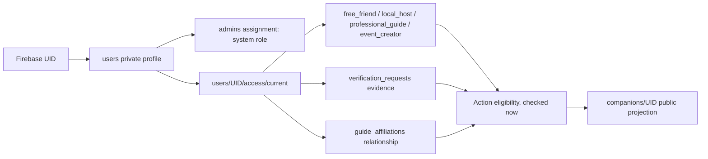

# Identity, capabilities and authorization

Target contract, 2026-09-09. Read with 20/31; not a description of current production permissions.

## One human, independent axes

Legacy `users.role` remains a display/compatibility field; not new authority. Canonical capability status per code: NOT_REQUESTED, PENDING, APPROVED, SUSPENDED, REVOKED. Verification status per claim: MISSING, SUBMITTED, UNDER_REVIEW, APPROVED, REJECTED, EXPIRING, EXPIRED, RESTRICTED. An approved capability can be temporarily ineligible because a credential expired, consent was withdrawn or its agency was suspended. Do not duplicate an independently editable eligible flag in every entity. Public projection is derived by trusted code and current eligibility is rechecked before commitments.

Age uses private verified DOB/evidence plus backend-derived `adultEligible`, evidence version and next review/expiry. Public profile never includes DOB/document identifiers. Self-entered age is not adult authorization. Email badge derives verified Auth state; phone badge requires completed verified phone credential, not users.phone text. Phone OTP UI is not implemented today. Browsing needs none; messaging/booking need phone; Free Friend needs adult+identity; Host adds service eligibility; Guide adds credentials+active verified agency; withdrawal needs adult+full KYC. Agency/Partner business verification does not verify each staff person's identity automatically.

Badge IDs: PHONE_VERIFIED, EMAIL_VERIFIED, IDENTITY_VERIFIED, AGENCY_VERIFIED, GUIDE_VERIFIED, BUSINESS_VERIFIED, BACKGROUND_CHECKED. Each requires its own evidence/source/issuedAt/expiresAt. Application review, phone verification and lack of complaints are never background checks.

## Actor action matrix

All grants below mean **scoped**, not all-resource access. C/U/D refer to command requests for owned/assigned records; backend executes protected transitions. D is withdraw/tombstone, never erase financial/evidence history. Everyone gets public general-content R; no actor gets private data merely because a card links to it. Capability actors inherit ordinary User rights. Unlisted grant = denied.

| Actor | R | C | U | D | Approve | Financial action | Sensitive data |
|---|---|---|---|---|---|---|---|
| Anonymous/guest | Public general catalog | None | None | None | None | None | None |
| User | Own account, entitled conversations/commitments | Own posts, applications, requests, reports | Own editable content/preferences | Own drafts/content per policy | Own acceptance consent only | Own spending/withdrawal request if eligible; no ledger write | Own metadata/contact, not other KYC |
| Free Friend | Own requests | Availability/boundaries | Own public service settings | Withdraw listing | Accept/reject hangout | NPR0 hangout; no P2P coins | Accepted hangout minimum contact only |
| Local Host | Own bookings | Service/price proposal | Own offers/availability | Withdraw future offer | Nonregulated request acceptance | Entitled earnings statement; no settlement mutation | Assigned customer necessary contact |
| Guide | Own affiliation/trips | Credentials, affiliation/price request | Own service proposal | Withdraw pending request | Invitation/relationship consent | Statements through agency; no agency payout account | Assigned trip contact, no customer KYC |
| Agency Staff | Assigned tenant modules | Operations/booking proposals | Assigned trip/calendar | Own drafts | Role-specific below | Finance role statements only | Minimum assigned trip info |
| Agency Owner | Own tenant operational data | Staff invitations/packages | Tenant editable/commercial proposal | Revoke staff, withdraw drafts | Agency affiliation/pricing, not SATHI verification | Settlement destination change REQUEST | Tenant documents + assigned customer contact, not raw guide identity docs |
| Partner Staff | Assigned offers and scanned pending redemption | Scan/confirmation request | Confirm/correct bill before finalization | Abandon own scan | Redemption confirmation only | No accounts/commission/payout controls | Masked redemption identity only |
| Partner Manager | Own tenant operations | Offers/campaign drafts/staff invite proposal | Operational offers/hours | Withdraw future offer | Offer operational publication after verified business | Statements if separately granted | No payout credentials/raw KYC |
| Partner Owner | Own tenant operations and statements | Invite staff/config requests | Ownership/payout change REQUEST | Revoke staff/withdraw offer | Staff role, not business verification | Own destination request; no rate override | Own business documents |
| Support Admin (support_agent) | Assigned cases, minimal account/booking | Case responses | Case status | No evidence destruction | No verification | None | Redacted context; explicit escalations |
| Verification Admin (kyc_reviewer) | Assigned verification queue/evidence | Review decision | Evidence status | No history deletion | Identity/guide/agency/business review; no self-review | None | Time-limited audited private document access |
| Finance Admin (finance_admin) | Financial records, minimum KYC verdict | Adjustment/refund/payout proposal | Proposal state | No ledger delete | Separate actor approval if delegated | Reviewed server commands, never direct balance writes | Masked provider/bank data, not broad documents |
| Agency Manager Admin (new agency_manager) | Agency operations/cases | Transfer/suspension proposal | Agency operations | No account/history delete | Affiliation ops; no credential sign-off | No settlement approval | Assignment-specific contact |
| Partner Manager Admin (new partner_manager) | Partners/offers/cases | Agreement proposal | Operations/suspension | No financial history delete | Operational offers; no business KYC sign-off | Commission proposal; finance approves terms | Business metadata, no bank secrets |
| Super Admin (super_admin) | Justified operational access | Role/config proposals | Security/role management | No immutable audit/ledger/evidence purge through ordinary UI | Sensitive role grants, dual-control policy | Cannot bypass ledger or self-approve own adjustment | Break-glass logged reason, expiry, alert |

Preserve remaining existing roles: platform_admin (support/config proposals, not universal root), safety_admin (assigned SOS/incidents), moderation_admin (content/report cases), booking_admin (booking operations), content_admin (catalog editing), analytics_admin (aggregate/deidentified analytics), read_only_admin (explicit redacted views, no raw KYC by default). Reconcile actual existing grants instead of assuming a numeric role hierarchy. New permission codes follow existing dotted vocabulary, e.g. `agencies.approve`, `guides.verify`, `guides.transfer`, `partners.approve`, `withdrawals.review`, `wallet.adjust.propose/approve`, `refunds.override.propose/approve`, `commission.modify.propose/approve`, `incidents.resolve`, `providers.suspend`, `config.change.propose/approve`. Map requested semantic names to these codes once in backend registry.

### Tenant staff RBAC

Membership key `organization_memberships/{kind_orgId_uid}`; tenant + active membership + permission required on **every request**. No org ID supplied by client is authority. Agency owner: tenant/staff/pricing; manager: guide/booking/package operations, no ownership/bank changes; operations: assignments/calendar/active trips/incidents; booking_staff: requested bookings/customer coordination, no price approval; finance: statements/settlement reconciliation, not guide identity evidence. Partner owner/manager/staff as above. Last owner cannot leave/revoke self until a verified replacement accepts. Payout/ownership changes require reauthentication, out-of-band notice, cooling-off and independent approval.

## Resource enforcement matrix

| Resource | R / create / update / delete | Approve or money | Enforcement |
|---|---|---|---|
| users | Self fields allowlist; no public list; user requests deletion | Trusted access/verification changes only | Rules private scope + backend |
| access/verification/identity_keys | Self sanitized verdict; assigned reviewer evidence; server-only uniqueness keys | Review requires evidence and non-self actor | Backend IAM/permissions; rules deny protected writes |
| companions/activities/public profiles | Public approved projection; owner proposes bounded fields; tombstone | Approved capability/price projection server-written | Rules visibility + immutable UID, backend qualification |
| Agencies/Partners and membership | Public approved summary; staff tenant-scoped private views | Staff invitation/verification separate; owner cannot self-verify | Rules membership lookups for reads, backend mutations |
| affiliation/packages | Relevant guide/tenant; public eligible package summaries | Atomic one-agency transition; approved price version | Backend |
| bookings/locks/trips | Customer + snapshotted guide/agency assigned staff; immutable ownership | Lifecycle actor guards; quote/payment separate | Backend transactions; deny alternate direct writers after cohort cutover |
| conversations/messages | Existing participants only; entitled context required for new send; member IDs immutable | Moderation only by case permission | Rules reject unauthorized paths; backend new gated messages |
| posts/comments/likes/Stories | Preserve currently approved workflows; owner edit/paired delete and protected moderation | No owner restoration of restrictions; Story likes only | Scoped rules plus existing media handlers |
| Events/members | Public eligible Event; own member/organizer minimum roster | Paid admission/publish fee requires ledger contract | Rules for proven free contract; backend paid changes |
| offers/redemptions/QR | Public eligible offer; claimant and assigned scanner see minimum details | Staff bill confirmation + backend atomic budget/reward | Backend, no client finalization |
| wallet/ledger/rewards/withdrawals/settlements | Owner statement projection; finance scoped views | Only trusted commands; proposer != approver | Rules deny all client monetary writes; backend/IAM |
| reports/SOS/locations | Reporter/affected participant + assigned moderator/safety; no public coordinates | Escalation/resolution audited | Backend scope/consent; rules read checks |
| audit/config | Redacted permission-specific views; versioned public configuration projection | Immutable logs; reviewed config activation | Backend writes; no normal-admin delete |

Firestore has document-level reads, not field redaction. Never grant a role the whole private document because it needs one field. Use deliberate read projections (public companions, case summary, finance statement) with one producer, schema version, source version and invalidation. Agency finance must not inherit Safety exact-location access.

Membership/verification revocation applies at action time using canonical docs; claims are coarse role hints, not long-lived tenant entitlements. Backends verify token and disabled/revoked account, fresh access state and config. Mutations read relevant membership in transaction to conflict with concurrent revocation. No broad isAdmin fallback. App Check is abuse defense-in-depth, not Auth or tenant authorization; enforcement requires verified web/PWA/native support first.

## Required authorization tests

Generate actor × resource × R/C/U/D/approve/finance/sensitive cases from tables, default deny. Include missing fields, explicit lesser role plus admin=true, anonymous Firebase identity, role revocation/stale token, self-review, tenant ID substitution, account switching, cross-user history reads, whole-collection queries, public media vs private KYC, denial of raw financial writes. Also test legitimate existing social/booking/KYC/admin payloads against each production-derived candidate. Server SDK tests must exercise command authorization, not assume emulator rules protect Admin SDK calls.
