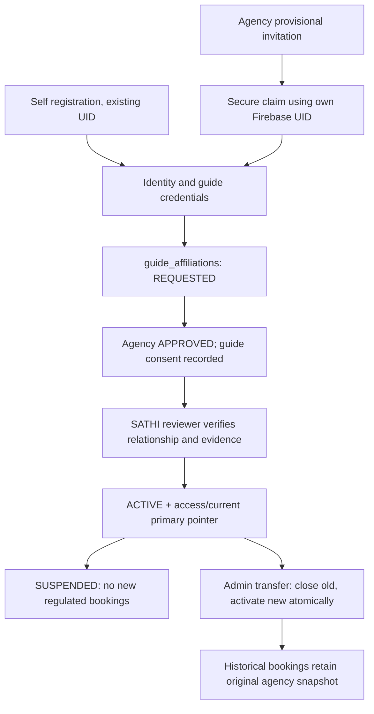
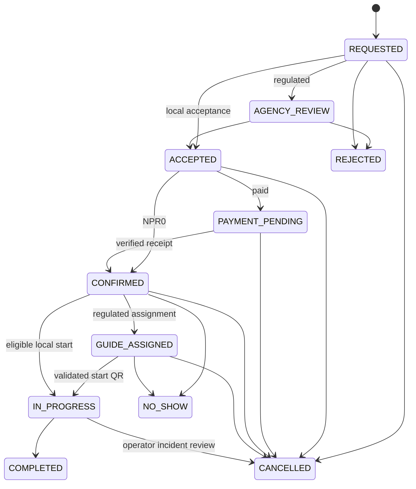

# Agencies, guides, service intents and booking evolution

Target specification; no current agency platform implementation claimed. Reuse companion_applications, companions, bookings, booking_locks, verification_requests, reviews and existing admin/booking components. `BOOKING_STATE_MACHINE.md` remains the implemented policyVersion=2 reference; this file specifies version 3 without rewriting history.

## Person/service boundaries

- Free Friend: NPR0 service fee, adult+identity eligible, interests/languages/hobbies/boundaries/availability/service area and optional adult age/gender preferences. Preferences are consent/matching criteria, never dating labels. Five distinct profile discoveries/day; unlocking is a platform discovery entitlement, not payment to the person. See 24/27.
- Local Experience Host: adult+identity+configured service eligibility; hourly/half-day/full-day/package prices proposed by host, versioned approved platform commission. Legal classification depends on activity/location, not terminology. Reuse companions public record with separate service mode summaries.
- Professional Guide: full identity evidence, current applicable credential and one verified primary agency; no independent regulated booking. Guide can retain other approved modes while unaffiliated, but cannot evade regulated policy by calling the same trekking service a local experience.

Backend service taxonomy includes `regulatoryClass`, `requiredCredentialTypes`, `requiresAgency`, eligible areas and effective policy version. A booking references one explicit service mode and a published price version. UI cannot switch mode after quoting to avoid checks.

## Guide registration and affiliation

Agency-created guide means a provisional **invitation**, not a second public identity or an agency-controlled password. Invitation stores intended verified contact digest, org, role/capability, issuer, expiration, nonce hash and status; no reusable password. User follows one-time link, signs into existing account or securely creates credentials through Firebase, verifies channel, then confirms relationship. Never auto-link Auth users by unverified email/name. Phone/email collision -> account recovery/review, not second UID. Invitation claim alone does not make guide bookable.

`guide_affiliations` states REQUESTED → AGENCY_APPROVED → ACTIVE; reject/withdraw before activation; ACTIVE → SUSPENDED or ENDED. SUSPENDED may resume after SATHI/operator review and valid credentials. `users/{uid}/access/current.primaryAgencyRelationshipId` is the single concurrency lock/pointer. Activation transaction reads pointer, old/new relationship, agency verification and guide access, verifies both consents, writes history/status/pointer and audit. Two agency approvals racing cannot both activate. Relationship provenance/intervals remain immutable except explicit close/resume events.

Transfer A→B: require admin `guides.transfer`, accepted B request, guide consent and reason. End A and activate B atomically; no historical booking reparenting. Upcoming A bookings generate operational tasks: retain A responsibility unless an explicit booking amendment is accepted by customer, old/new agency and guide with new audit snapshot. Suspension/expiry blocks new bookings, flags upcoming work; do not delete Auth, discard bookings or prevent access to support/history.

### Duplicate protection and document lifecycle

Server normalizes document type + issuer country + identifier per issuer policy; Unicode/spacing rules documented per type. HMAC-SHA256 with versioned secret creates private identity_keys key. Raw identifiers encrypted in private verification records or approved vault, never logs/public IDs. Approval transaction reserves key if unused or same UID; conflict enters duplicate-resolution queue (not automatic accusation). Verified phone/email are supplementary signals, not proof a household shares one identity. Admin duplicate resolution requires two-person review, evidence, survivor UID mapping and explicit Auth recovery; never auto-merge wallet/booking history. HMAC rotation reads both versions during bounded migration and preserves uniqueness under concurrent approvals.

Extend verification_requests to subject user/agency/partner with credential type, masked metadata, private Storage path, issued/expiry dates and review history. Agency company registration, PAN/VAT, tourism licence, responsible person, office and applicable insurance each independently reviewed. Agency must pass manual SATHI verification. Missing → Submitted → Under Review → Approved; rejection/change request branches; warning/expiring/final warning → expired → restricted using configured document grace. Security-critical licence expiry denies regulated actions immediately; grace may keep dashboard/document renewal access, never make an expired legally required licence valid.

## Pricing and agency dashboard

`agency_packages` own packages/itineraries/service areas; immutable `priceVersions` child records. Guide hourly/half/full/package proposal uses companion_applications with kind=PRICE_CHANGE and serviceMode=professional_guide, agency relationship reference and proposal values. Agency approves/adjusts, guide notified; public price cites approver/version, previous versions retained. Local Host owns own proposal but cannot modify snapshotted commission. Booking snapshots accepted version, party IDs, gross, commission basis, fees, cancellation and settlement agreement. No `companions.hourlyRate` mutation changes past bookings.

Desktop-first dashboard, existing token/card/table grammar: Overview; Guides, Invitations, Applications/Affiliations, Staff; Booking Requests, Calendar, Upcoming/Active Trips, Customers; Packages, Pricing, Availability; Earnings/Settlements/Commission; Documents/Verification; Notifications, Performance/Reliability/Reviews; Incidents/Emergency/Reports. Modules can be tabs/sections, not 25 new routes at once. Empty metrics show unavailable until produced. Use tenant membership permissions from 21. Agency cannot access every guide's raw KYC or arbitrary customer history.

## Booking v3 contract and compatibility

One `bookings/{id}` spans customer/provider/agency/admin/payment/review/trip/QR/SOS/refund/settlement. `schemaVersion=3`, `serviceMode`, `lifecycleState`, `stateVersion`, `userId`, `companionId/companionUid`, optional immutable agencyId+affiliationId, price/cancellation/config snapshots, startAt/endAt UTC, serviceAreaIds and audit operation IDs.

Free Friend's canonical commitment is `hangout_requests/{id}`, not a duplicate booking. Its REQUESTED/ACCEPTED/REJECTED/EXPIRED/CANCELLED/COMPLETED machine is defined in 31; messaging, review and safety references use typed `{kind: HANGOUT, id}`. The booking machine below is for Local Host/agency services; its NPR0 branch is an explicitly complimentary service quote, not a second Free Friend workflow. Do not mirror hangouts into bookings. A unified consumer history is a read view over these typed commitments.

Do not overload lifecycle with money/safety/review. `paymentState`, `disputeState`, `safetyState`, `reviewId` are orthogonal. Requested product labels Refunded/Refund Pending/Emergency/Reviewed derive from these dimensions. Guide assignment may exist provisionally before confirmation; confirmation requires a reserved eligible provider/resource, and display `GUIDE_ASSIGNED` records final operational assignment. All states are typed and CAS-versioned.

All transitions append audit, stable notification intent and stateVersion in the same transaction. Notifications go to affected participants/assigned agency, not all tenant staff. Table defines additional guards/effects:

| Transition | Actor | Guards | Effects / notification |
|---|---|---|---|
| create REQUESTED | Eligible customer | adult/phone, non-self, capability, active service/agency if needed, valid quote request, block checks | Reserve idempotent intent; notify provider/agency. No debit before verified payment/approved ledger operation. |
| REQUESTED→AGENCY_REVIEW | Backend for regulated | Current primary agency verified | Review task, snapshot responsible agency |
| review→ACCEPTED/REJECTED | Agency booking permission; local host for own mode | Recheck eligibility/availability; approved price; immutable actor | Accepted reserves inventory atomically; rejection notifies customer |
| ACCEPTED→PAYMENT_PENDING | Customer via backend | Paid mode enabled, lock held, quote not expired | Create provider intent outside transaction via durable operation; no paid claim |
| pending→CONFIRMED | Backend | Verified matching provider receipt, currency/amount/order, live reservation | Commit allocation; notify parties. Late payment after hold expiry -> reconciliation/refund, not forced booking. |
| CONFIRMED→GUIDE_ASSIGNED | Agency operations | Eligible guide, atomic release/reserve if assignment changes, customer-consistent package | Assignment notice with responsible guide |
| confirmed/assigned→IN_PROGRESS | Backend on customer's valid start QR confirmation; explicit agreed local start | Start window, both eligible, reserved provider, unused token, no blocking dispute | Consume token when used; trip start; ask tracking consent separately |
| IN_PROGRESS→COMPLETED | Guide/Host or agency operations proposes; customer confirms, timeout requires review | After end, completion evidence; no unresolved blocking dispute | Create review entitlement, settlement eligibility pending policy, stop tracking; no direct payout |
| pre-start→CANCELLED | Customer/provider/agency within permissions | Current version; actor-specific cancellation policy | Release locks, immutable reason, server refund determination; notify all affected |
| pre-start→NO_SHOW | Provider/customer reports; operations adjudicates | After start+configured grace, evidence, right to respond | Block automatic settlement until adjudication, reliability signal not irreversible score |
| in-progress cancellation | Booking operator only | Incident/reason, safety coordination | Keep audit/trip evidence; financial manual review |

Dispute open/resolve requires own participant report and assigned operator resolution; payment/refund progression remains separate. Terminal lifecycle never reset; reschedule = amendment protocol or cancel/new booking, preserving original ID history. Free Friend completion requires accepted real hangout and both-party confirmation (or reviewed evidence), not simply a clock expiring.

Version 2 adapter preserves exact legacy statuses and meaning: pending=requested, confirmed=accepted unpaid reservation (NOT v3 paid-confirmed), active=in-progress, completed=completed, cancelled=cancelled. Do not write v3 fields on a legacy client operation or reinterpret legacy paymentStatus. New backend uses v3 only after cohort cutover; one writer per booking version.

Inventory initially retains existing `lock_COMPANION_YYYY_MM_DD` with underscores for date separators. For multi-day trips reserve every Nepal day, bounded maximum duration from policy; read/check all keys before writing. Existing active v2 locks block v3 too. Do not introduce a second interval inventory alongside day locks. Finer slots need a later explicit ADR/migration. Unpaid pending holds receive expiresAt and trusted sweeper only after backend release; transaction expiry checks are authoritative, TTL deletion is not.

Cancellation refund base is the disclosed refundable paid amount, not an unverified quote; whole paisa arithmetic, floor fractional refund paisa, exact >24h/6–24h/<6h boundaries. Provider cancellation defaults full eligible refund; admin override requires reason and independent financial approval. Already refunded amount caps remaining refund; failure never destroys original payment record.

Reviews: reuse `reviews/{transactionKind_transactionId_customerUid}`. Backend verifies actual completed eligible booking/hangout, exactly one entitlement, rating 1–5, customer author. No reciprocal provider reviews. Edit/moderation updates aggregate by revision receipt, not repeated create increments. Public provider profile shows verified-experience badge only for this linkage; legacy embedded arrays are historical unverified until provenance review. Reliability uses inspectable events (commitment, late cancel, no-show adjudication, dispute outcome, response interval); disputes alone are not guilt. Time windows, reasons, correction/appeal and recomputation version must be visible to operators.
