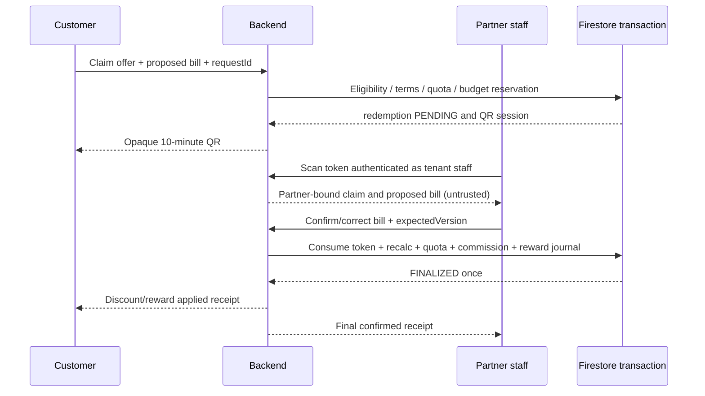

# SATHI Partners, offers and secure QR redemption

Target only. Existing `partners` catalog and PartnerDashboard unavailable-state UI are reused; no new competing business identity. Agency organization and Partner organization have separate business responsibilities; their human staff use existing Firebase UIDs.

## Business lifecycle and surfaces

Partner types: hotel, hostel, cafe, restaurant, bar, club, activity_provider, spa, rental, shop. `partners/{id}` public projection: name/category, logo/media, description, structured areas/coarse map point, timezone/opening-hours with verified freshness, menu/service references and published offers. Business private documents and payout configuration are never in public partner documents. Existing hotels/restaurants/cafes remain catalog sources during adapter migration; crosswalk records identify linked partner, no duplicate redeemable business.

DRAFT → SUBMITTED → UNDER_REVIEW → APPROVED; REJECTED can submit corrected revision; APPROVED → SUSPENDED, reinstatement by authorized reviewer/operator with reason. Only approved and currently eligible businesses have redeemable offers. Owners cannot set approval. Staff/manager/owner duties in 21; SATHI business verifier, partner operator and finance approver are distinct permissions.

Profile emphasizes value, location, opening status (unknown if stale), media, terms, and Redeem. Dashboard: overview, offers/menu/hours/media, scanner, redemption history, staff, verification, settlement statements; not a cloned finance/admin app. Reuse existing responsive shell/table/form patterns, add modules incrementally.

## Offers and immutable agreements

`partner_offers/{id}`: partnerId, kind=PERCENTAGE|FIXED|COIN_CASHBACK, minimumSpendPaisa, percentBps/fixedDiscountPaisa/cashbackCoins, maxDiscountPaisa, area/category, audience policy, startsAt/endsAt, frequency rule, budget unit/amount, usedBudget/reservedBudget, version, status DRAFT|PENDING_REVIEW|PUBLISHED|PAUSED|ENDED|REJECTED. Publication validates compatible integer terms and current business approval. Once a claim exists, edit creates a new immutable terms version; pending claims retain version but still respect emergency disable/suspension.

Partner-specific commission agreements live in partners/{id}/agreements/{version}: percentage/fixed/zero/default/custom, effectiveFrom/effectiveTo, base definition, tax/fee treatment and approver IDs. Defaults never silently overwrite custom agreements. `commissionBase` must explicitly name confirmed pre-discount or net bill amount. Overlapping active intervals rejected. Partner manager proposes, finance approves, partner accepts contract; historical redemptions snapshot agreement version/rate/base/amount.

Frequency keys: offerId + userUid + periodKey (once-ever, Nepal calendar date, ISO week anchored Monday in Asia/Kathmandu, or configured duration bucket). `offer_usage` records finalized and pending counts. Cap budget atomically: a claim reserves its configured maximum potential benefit, or is refused if insufficient; don't promise arbitrary bill amounts against an unreserved budget. Recalculation at staff correction cannot exceed authorized cap; if increase exceeds reserved budget, atomically acquire difference or ask customer to reconfirm reduced/new terms, never silently award extra. Release reservation on expiry/cancel via replay-safe transition, not TTL alone.

## Redemption protocol

User flow labels: Claim → Enter Bill → Generate QR → Staff Confirms → Reward/Discount Applied. QR generated ≠ redeemed. Cashier sees masked customer identity, actual offer/version, proposed amount and correction input. Corrected terms/amount visible to customer before acceptance where benefit changes; staff cannot rewrite a finalized redemption.

`partner_redemptions/{id}` lifecycle PENDING → FINALIZED, or CANCELLED/EXPIRED/REJECTED; FINALIZED → REVERSAL_PENDING → REVERSED via compensating ledger operation. Original finalized terms, amounts and journals remain immutable; the audited status projection may advance by versioned command. Both claimant and scanner use stable IDs and status lookup after unknown response. Finalize transaction reads token, redemption, offer budget/usage, partner verification, staff membership, config and affected wallet; writes all invariant records, immutable journal/audit and notification intent atomically. If monetary reward batch grows beyond supported transaction budget, reward remains explicitly PENDING with durable idempotent worker, never UI credited before ledger commit.

Discount math: integer paisa; percentage = floor(confirmedBillPaisa × bps /10000), bounded by bill, maxDiscount and minimum spend. Fixed discount similarly capped; cashback uses snapshotted integer formula and cap. Currency always NPR. Tax/discount legal invoice treatment is agreement-controlled and requires owner/provider approval.

## QR threat model and shared token service

Reuse one trusted QR mechanism (`qr_sessions`) with **different purposes** PARTNER_REDEMPTION and TRIP_START; no cross-purpose acceptance. Opaque cryptographically random 256-bit nonce, server stores only digest. Session binds target ID, user, partner/booking, offer/version, state, expiresAt, issuedAt and expected version; config default 600 seconds. Token never contains trusted bill amount, private coordinates, KYC or payout details. No token in URL logs/analytics/referrers. Rate-limit issuance/scans server-side; one active session per claim, regeneration atomically invalidates old token.

Before finalizing: verify caller Auth/active tenant role, age/claimant eligibility, purpose, hash, expiration by server time, partner/user/offer binding, current status and resource versions. Concurrent scans: exactly one transition, duplicates return same receipt. Wrong partner/user/token purpose fails without disclosure. QR screenshot replay is stopped **after use**; screenshots/real-time relay cannot be made impossible. Add visible customer confirmation/fresh challenge for configured high-risk claims; do not market perfect screenshot prevention.

Trip start: customer scans eligible guide booking QR, backend checks customer participant, assigned guide, confirmed lock, start window and one-time status, then transitions booking/trip. Not a payment receipt and not tracking consent. Staff cannot start arbitrary customer's trip by scanning a partner offer.

## Required tests and release gates

Test malicious client amount, staff correction, min/max bounds, 0/negative/huge values, budget exhaustion, simultaneous last redemption, same-day/week timezone boundary, duplicate/out-of-order finalize/reversal, expired/replaced QR, wrong tenant/purpose/user, membership revoked during scan, partner suspended after claim, unknown response recovery, malicious unauthenticated reads and no raw tokens in logs. Cashbacks require Phase 3 ledger before launch; discount-only pilot can run after approved business contract. Finance statements reconcile journal entries against finalized receipts, not UI totals.
