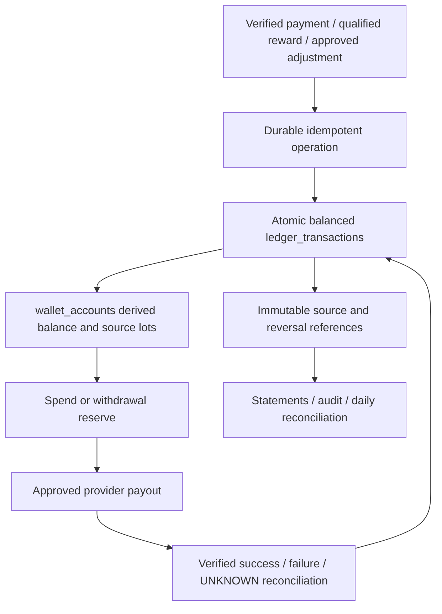

# Payments, SATHI Coins, ledger and settlement

Target design only: **do not implement or enable money movement in this architecture session**. Reuse payments.ts as frontend abstraction; it currently fails closed. No production merchant/provider verification, wallet, refunds or settlements are established by this document.

## Product and compliance boundary

10 whole Coins = NPR1 (one Coin = 10 paisa); withdrawal minimum 5000 Coins = NPR500. Purchased and earned Coins display as one balance; retain source, funding and cash-eligibility internally. Coins do not expire and cannot be transferred P2P. Do not implement a transfer API or writable user.coinBalance. Non-expiry of value does not require permanent retention of unrelated personal telemetry.

Flags default off: paymentsEnabled, walletEarnEnabled, coinPurchaseEnabled, coinSpendEnabled, cashRedemptionEnabled, paidEventsEnabled, deepReferralRewardsEnabled. `cashRedemptionEnabled` additionally requires full verified adult KYC, approved payout rail, merchant/regulatory sign-off, source eligibility and funding reconciliation. Enabling a flag alone cannot waive guards. Purchased-coin withdrawal, tax treatment, refundable purchase policy and gifts/tips require owner/provider/legal approval. Default cash eligibility is NONE until an explicit funded-source policy is approved; do not assume bought or promotional Coins are withdrawable.

**Free Friend tips/gifts conflict resolution:** hangout fee remains NPR0 and Coins cannot move between humans. Initially support only nonfinancial thank-you gestures. A future monetary tip/gift is a separate regulated provider purchase/reward contract with recipient eligibility, funding, tax, reversals and platform ledger—not a disguised P2P coin transfer. Keep that feature off until separately approved; do not promise cash tips today.

SATHI must not claim licensed escrow. Provider-held/pending settlement is an operational state only after contract confirms the provider's real custody arrangement. Agency receives regulated booking settlement and pays guide itself; SATHI does not maintain another guide payout for the same booking. Local Host/Event organizer settlement requires separately verified recipient and agreement, not P2P transfers.

## Canonical ledger

Use immutable `ledger_transactions/{operationId_asset}` with bounded posting array; no separate editable ledger entries collection necessary initially. Fields: operationId, asset (COIN or NPR_PAISA), entries [{accountKey, signedAmount}], sourceType/sourceId/sourceVersion, policyVersion, actorUid/systemActor, idempotencyKeyHash, intentHash, createdAt, reversalOf?, accountingPeriod. Every entry nonzero integer within safe integer bounds; sum per asset =0; never net Coins against paisa. Top-up/exchange atomically creates one balanced journal per asset, linked to one operation receipt. The asset suffix prevents the two journals colliding under the same operation ID. Counterparties include provider-clearing, platform-funded-coin obligation, user available/reserved, redeemed-coin sink, agency payable, platform commission, refund payable. Finance must approve chart of accounts before real money launch; these are accounting controls, not a legal custody classification.

`wallet_accounts/{uid}` is an atomic derived projection: availableCoins, reservedCoins, cumulative credited/debited, version, updatedAt. It is never a second independently editable authority. Replay journals must reproduce it. `lots/{grantId}` stores source grant, remaining available/reserved, cash eligibility and funding proof; allocated debits reference lot IDs. At most 20 lots per synchronous operation; if allocation exceeds cap, fail with consolidation/retry state and trusted resumable consolidation preserving provenance—not a broad read in a transaction. Ordered allocation oldest eligible funded first; no expiry; purchased/earned appear unified in normal UI. Finance can inspect source composition.

Immutable posted journals cannot be updated/deleted by clients or normal admins. Corrections are equal/opposite reversal entries with original ref and reason plus a new corrected transaction if needed. Balance cache repair is a privileged offline/reconciliation procedure with lock/version, replay result and audit, not an admin form. Negative available balances rejected; chargeback after spending freezes future spends and records debt/receivable separately without deleting history.

## Atomic spending and withdrawal race

`operations/{actorUid_requestId}` stores operation kind, normalized intent hash, status, result refs, actor, version, timestamps. Namespace validated safe, UUID request IDs stable across retries. Long-lived financial source dedupe also binds provider+merchant+transactionID in payment_receipts; expiry of a generic operation record must never allow duplicate money.

Withdrawal transaction reads own wallet, eligible source lots, existing request, current config/access and payout destination verification. Require integer amount>=5000, eligible available>=amount, no restriction and cash enabled. Decrease available, increase reserved, create `withdrawals/{id}` RESERVED plus reserve journal and receipt atomically. For two requests against exactly5000, first reserves, second insufficient; same request ID returns first record. No external provider call inside retryable Firestore transaction. [Firebase transaction behavior](https://firebase.google.com/docs/firestore/manage-data/transactions).

Withdrawal states: RESERVED → UNDER_REVIEW → APPROVED → SUBMITTING → PAID; RESERVED/UNDER_REVIEW may CANCEL/REJECT and release via reversal; provider error → FAILED only if confirmed no transfer; timeout → UNKNOWN, keep reserved and reconcile. Never automatically release UNKNOWN. Payout operation ID is provider idempotency key if supported; if provider lacks dedup/lookup, do not blind retry and do not enable unattended payouts. Separate requester/proposer and approver; admin cannot approve own adjustment/refund/destination change. PAID consumes reserved, not debit available again.

## Payment-provider boundary

Interface: initiate(intent), verify(reference), fetchStatus(reference), refund(intent), fetchRefundStatus(reference), payout(intent), fetchPayoutStatus(reference), reconcileWindow(cursor). Mark unsupported provider capabilities explicitly; purchase checkout does not imply payout support. Existing PaymentProvider khalti/esewa preserved; approved banking rail may be added. No Stripe default for Nepal.

Backend creates payment intent for owned valid booking/top-up/Event admission; derives amount/order/merchant/return allowlist, snapshots provider config version and calls provider with server secret. Browser sees hosted redirect and payment ID only. Signed callback/webhook when supported is verified per provider contract; browser redirect starts server verification, never declares payment success. Bind verified result to expected merchant, provider transaction ID, amount/currency, order, account and state. Duplicate/out-of-order callbacks converge by current provider truth and idempotent receipt, not trigger delivery order. Scheduled reconciliation handles callbacks never arriving.

Khalti documents server-side initiation, amount in paisa, pidx and lookup verification; adapter must preserve these units. [Khalti Web Checkout](https://docs.khalti.com/khalti-epayment/). eSewa documents signed fields/HMAC and transaction status checks; implement its decimal-NPR boundary conversion exactly, not copy Khalti units. [eSewa ePay](https://developer.esewa.com.np/pages/Epay). Checked 2026-09-09; revalidate sandbox/version and merchant entitlements at implementation. Do not invent webhook signature or payout endpoints where provider offers none.

Payment states INITIATED, PENDING, VERIFIED, FAILED, CANCELLED, EXPIRED, UNKNOWN. Refund states REQUESTED, APPROVED, SUBMITTING, VERIFIED, FAILED, UNKNOWN; partial refunds tracked by immutable amounts. A verified payment after reservation expiry cannot force service confirmation: queue refund/rebooking resolution. Currency mismatch or duplicate provider transaction linked to another order quarantines the receipt.

Settlement states PENDING_SERVICE → ELIGIBLE → RESERVED → APPROVED → SUBMITTING → SETTLED, with DISPUTED/FROZEN/UNKNOWN/reversal paths. Immutable booking/offer agreement determines gross, discount funding, tax/fees, commission, refund deductions and payable. Never recompute old commission using today's rate. Customer payment, provider verification, commission posting and agency payout are distinct facts; labels must distinguish them.

## Controls and reconciliation

Daily checkpointed job compares payment_receipts/provider statements with payments, journals, wallet caches/lots, refunds, withdrawals and settlements. Check balanced assets, one receipt per provider transaction, no double reserve, sum finalized rewards, outstanding liability vs funding, and aged UNKNOWN. Record reconciliation_runs summary and per-source discrepancies; repair via approved adjustment only. Queries bounded by provider/cursor and accounting period, no entire ledger scan on dashboard. Large historical replay is offline checkpointed tooling.

Secrets in managed server secret storage; no VITE credentials. Least-privilege service accounts; split payout initiation from approval, restrict deploy/IAM authority, log immutable audit and alert on adjustments/large payouts. Even super-admin UI cannot bypass dual approval; emergency operational freeze available without deleting audit. Export encrypted immutable audit copies under separately approved retention for protection against privileged cloud compromise; Firestore client rules alone cannot constrain project owners.

Tests: simultaneous withdrawals, duplicate provider receipt, wrong currency/unit/merchant/order, tampered callback, delayed verified receipt after cancellation, partial refund/reversal twice, account blocked after reserve, chargeback after spend, reconciliation mismatch, cross-user statements, mixed source lots, coin cost config changes, provider UNKNOWN and crash before/after external call. No purchased coins/rewards/real payouts until those tests plus provider sandbox and approved controlled live acceptance pass. Existing browser unavailable states remain until feature-specific release approval.
