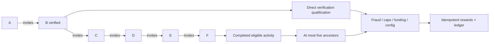

# Referrals and qualified rewards

Target only; no production referral producer exists. Existing invite marketing is disabled. Reuse Firebase UID, verification verdict, immutable ledger/rewards from 24, notifications and admin fraud queues; do not infer referral ancestry from URL/localStorage after attribution is committed.

## Graph and qualification

`referral_codes/{opaqueCode}` maps owner UID; `referrals/{inviteeUid}` is the one immutable parent edge, campaign/version, attributedAt, qualifiedAt, source, status PENDING|QUALIFIED|HELD|REJECTED|REVERSED. Attribution allowed during configured signup window, before qualification, only once. Backend resolves code; self-referral denied. User-existing-parent is not replaceable to farm rewards.

Maintain at most five ancestor UIDs in edge (server-derived cache, not separate truth) and verified monotonic signup ordinal: referrer must predate invitee's immutable account creation/attribution cohort. That ordering prevents cycles globally without unbounded graph traversal, including cycles longer than five. Reject equal/unknown ordering pending review; do not scan to root. Verify unique ancestor set and no self within bounded chain as defense-in-depth. Admin corrections never silently relink a rewarded graph; freeze affected rewards, simulate corrections and append audited compensating attribution event; no recursive live rewrite.

Direct reward only after configured verified identity/phone and anti-abuse qualification. Levels2–5 **never pay for recruitment**; only approved completed booking, valid partner redemption or explicitly qualified funded activity. Source completion must be genuine, not self-trade, cancelled/refunded, or a raw new-account event. Default direct/multilevel features off until policy/funding approval. Referral depth<=5, per-source distribution sums within funded budget, per-user/day/month/campaign caps, minimum account age and delayed vesting configured centrally. A new referral does not imply entitlement to cash.

Rewards id = hash(sourceType/sourceId/beneficiaryUid/rewardKind). The source is the stable qualified economic activity, not a trigger delivery ID. Level, sourceVersion and policyVersion are immutable grant metadata, not deduplication-key inputs: a policy update or re-delivered revised source must not create a second grant for the same activity/beneficiary/kind. Transaction checks receipt and budget cap, creates reward PENDING or HELD, then ledger posts exactly once at vesting. Concurrent workers same source return same result. At most five ancestors, maximum transaction posting size enforced. Partial fanout uses durable per-beneficiary receipts and parent completion cursor; never mark all paid after only first recipient. Source reversal creates linked reversing entries; already withdrawn rewards trigger reviewed debt/freeze, never erase journal. Any subsequently approved adjustment has a distinct reviewed correction operation, never a new automatic qualification.

Fraud signals: normalized verified identity key collision, repeated device/payment instrument (privacy-limited), same beneficial owner, suspicious redemption patterns, repeated cancellations/chargebacks, circular commercial activity. Signals queue review, not automatic criminal label; shared household/device alone insufficient. Reason codes, evidence access, appeal and false-positive correction. Do not publish referral descendants/phone/email to referrer; show consented aggregate qualification/reward status.

Tests: self and multi-level cycles (including >5), concurrent attribution, existing user/code substitution, stale signed signup evidence, depth6 ignored, same transaction multiple triggers, cancelled source, daily boundary Asia/Kathmandu, aggregate budget, same identity multiple UIDs, false-positive release, reversal twice, lost acknowledgment and deny all client graph/reward writes. Retention follows financial journal policy for paid grants; unnecessary attribution telemetry expires under privacy schedule. No launch until owner reviews multi-level commercial/legal implications; five levels is maximum supported policy, not legal clearance.
