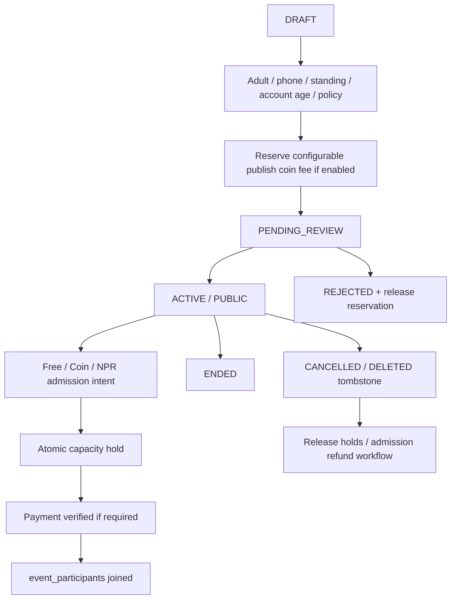

# Events — extend the existing contract

Target extension of current `events`, `event_participants`, `event_likes`, `event_comments`, EventActions/CreateEventModal/mediaUploadCore and mediaSocial functions. Do not build a second Event collection or re-add Stories comments. Local capacity/deletion work already exists; [focused delivery report](FOCUSED_EVENTS_NAVIGATION_RESULT.md) is its evidence and rollout prerequisite.

## States and eligibility

Phone+adult+active account, verified organizer capability, configurable account-age/trust threshold and moderation required for new publishing. Existing ACTIVE/PUBLIC statuses remain readable during compatibility; new drafts cannot use old permissive create path. Configured significant coin cost is mandatory policy before enabling public paid publication; no invented cost default. Reserve cost at submit, consume once on publication, release on rejection/withdrawal, abuse penalties only under disclosed versioned policy. Disabling new creation must not disable existing attendees' cancellation/history.

Existing capacity: spots positive integer maximum, participantCount, participationVersion=1; deterministic member `{eventId}_{uid}` joined/cancelled. Free join remains exact two-document transaction after approved scoped rule rollout. New paid model adds reservedSeatCount and admission intents; capacity invariant joined+held<=spots enforced by backend transaction, not array size or offline card value. Existing free transaction/rules must account for held seats before a paid cohort can share inventory. Paid/coin admission uses same membership ID and separate payment/ledger ref; retries never debit twice. Timeout releases seat only after authoritative payment status; late payment after expired seat goes to reconciliation/refund, not overselling.

Paid hold authority is `event_admissions/{eventId_uid}` with incrementing attemptVersion, holdExpiresAt, status, paymentRef and operationRef (31). One outstanding hold per user/Event. Finalizing atomically consumes that hold and creates/reactivates the existing membership; it does not count both as occupied seats. A retry reuses its operation; a new attempt after cancellation gets a new version/payment, and delayed callbacks must match that exact version. Historical financial attempts remain in immutable receipts/journals and operations, not overwritten with the latest admission view.

Minimum admission fields: priceType FREE|COIN|NPR, price snapshot/version, organizer UID/optional organization, endAt, cancellation policy, settlement agreement. Free/general catalog may be browsed by minors; joining/creation/paid/nightlife follows adult policy. Do not call an event free if a mandatory coin admission fee exists. Organizer earnings settle only after completed eligible event/adjudication, through verified recipient account; never enable arbitrary P2P transfer.

Owner deletion is tombstone + media unlink, not removal of attendee/payment history. Cancellation triggers notifications and refund obligations. Restriction/suspension hides public cards and blocks new join, but own membership/history/support remain readable. Legacy records without version/count stay nonjoinable until trusted dry-run reconciliation of real joined members; never manufacture attendance. Existing event_likes/comments notification receipts preserved, aggregate ownership not duplicated.

Reads: retain `mediaQueries.eventSummaryQuery` and direct detail route while introducing versioned active/upcoming startAt index in 31; parent summary count, not per-card attendee scans. Only owner/authorized operations see necessary attendee details; no public phone/name roster. Ended/moderated removal must revalidate existing windows without reshuffling survivors. Offline admits no confirmed seat/QR/payment.

Tests: existing 20/21-seat, last-seat race, duplicate join/leave, legacy cancel and owner tombstone gates; new coin fee reserve/consume/release once, rejected moderation, age/phone deny, paid last seat race, revoked organizer, cancellation refund idempotency, expired hold/late payment, attendee privacy, stale client/rule compatibility. App+rules+indexes must be released coherently after fresh production comparison; do not infer live participation from local emulator success.
