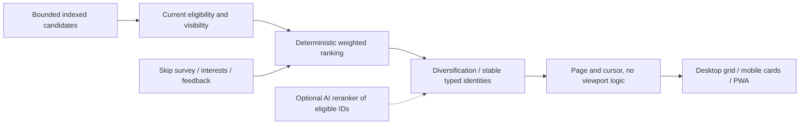

# Discovery, personalization and Free Friend access

Target evolution of useFirestoreData, useVisibleStories, useDiscoveryFeed, feedGenerator, feedStabilizer, useProgressiveReveal, discoverySearch and Companion cards. Baseline must work without AI; retain Community/Stories in Home alongside new eligible domains.

## Pipeline and limits

Existing discovery retrieves bounded document-ID pages, not full-database search. Proposed server feed endpoint queries at most four pools per page, each <=20 candidates (budget80), parallel within budget, then returns <=20 cards. Rotate source pools using opaque signed cursor carrying per-source continuation/query fingerprint/config version/session seed, never expose private scoring inputs. If filtering exhausts budget, return sparse page + hasMore/cursor; no fetch-until-20 scan. Initially use city/service-area/category equality plus approved/published projection and document-ID fallback; exact new indexes in 31. Cap all loaded windows; metrics include actual billed reads/rule reads/response bytes/empty pages, not merely returned cards.

Eligibility precedes ranking: adult restricted mode, verified capabilities, public/active moderation, mutual block, entitlement, valid agency/credential, availability relevant to intent, and privacy. Recheck at action time; a stale card never authorizes booking. Region/geohash bounding queries are approximate candidates, exact distance done on bounded results with location consent. Avoid composite explosion: whitelist supported filter combinations; do not promise general full-text search from Firestore contains filters.

Initial normalized score 0..1: interest .25, area .20, available .15, verified-experience rating .10, bounded real engagement .10, explicit past behavior .10, freshness .10. Trust is a hard eligibility filter plus explained verified evidence, not an opaque punishment bonus. Missing ratings/behavior omitted and remaining weights normalized; cold-start uses geography/category/freshness, no fake popularity. Scores are proposed configurable values; version logged in explanation. No popularity manufactured from seeded counts. Diversify caps by entity type/provider, no repeated UID in one page, max three consecutive people when alternatives exist; label sponsored placements separately, never paid safety bypass.

Shared composer creates `FeedBlock` category rows containing up to three eligible real people, with stable typed key `{kind}:{id}`; desktop displays columns, mobile same members in compact row/stack. Move current desktop companionRows selection into shared engine before new ranking. Do not add a mobile algorithm. Keep visible survivor order on append; refresh payloads by source version. Explicit refresh may reseed; moderation/deletion/expiry removes blocked content immediately on fresh validation. New arrivals append or show “New items” control, never silently move visible cards. `Not interested`/`Show less like this` immediately suppress ID/category locally and persist owner feedback for next request; opt-out and reset available.

## Optional onboarding

Question: “What brings you to SATHI?” Find people, Explore the city, Find a guide, Join events, Discover offers, Travel, Meet locals. Interest choices: hiking/shopping/food/packages/travel/nightlife/photography/culture/nature/sports/coffee/music/language/wellness/hobbies and optional style preferences. Skip is first-class; never infer sensitive traits from missing answers or require survey for basic browsing. Store version/consent in existing users.preferences; geographic permission optional, selected service area fallback. Adult status is separate verification, not survey answer.

## Free Friend discovery/unlock semantics

Explicit product decision: a discovery counts when the eligible user **opens the full profile**, not when a teaser appears in feed. First five distinct provider UIDs per Nepal calendar day cost zero. Reopening the same profile already granted does not consume quota; initial unlock grants are permanent while profile remains eligible, not daily recurring charges. This policy avoids double charging on refresh; owner may revise future grant duration only with disclosed version change, not revoke purchased history silently.

Public companions record contains teaser only for Free Friend mode; full boundaries/availability/preferences live in private `users/{providerUid}/provider_settings/free_friend`, returned by authorized backend after grant. Never store paid-gated fields in public Firestore documents and pretend a hidden button protects them. Already-public historical data cannot be recalled; migration preserves originals privately, redacts new public projection with explicit consent/review. Guest teaser browsing does not consume adult quota or permit contact.

`discovery_usage/{uid_nepalDate}` and `profile_unlocks/{uid_providerUid}` transact together with spend journal when needed. UID, adult identity/phone, provider eligibility and mutual blocks checked; if grant exists return it; else free quota<5 grants/increments once; else require explicit confirmed configured coin price and atomic available balance debit. Lost response same ID/status lookup; different-tab sixth/seventh opens race safely. No client day boundary or localStorage counter. Cost 0 for first5; after threshold show exact coin price before intent. If wallet spend disabled, say daily limit reached, never simulate unlock.

Hangout request: grant → private eligibility/safety checks → hangout_requests REQUESTED → ACCEPTED/REJECTED/EXPIRED/CANCELLED → completion eligibility. Only backend acceptance creates conversation entitlement. Existing chat is not an escape hatch: new Free Friend/regulated context sends require valid entitlement and contact policy even if pair already has a generic conversation. Preserve old history read access subject to blocks/safety, but do not automatically grandfather new privileged sends. Rules must reject alternate client creation/sends that bypass this path.

AI interface receives only eligible public IDs and bounded safe attributes; validates every returned ID against candidate set and recomputes availability/permissions. Timeout/invalid output falls back deterministic, no synthetic person/offer/event. Treat user-generated bios as data, never AI instructions. No private KYC, exact trip location or raw chat in ranking prompts. Tests cover sparse/cold-start, same-ID edit, type-ID collision, blocked/restricted removal, append stability, breakpoint parity, quota midnight/DST-independent Nepal date, concurrent charge, invalid AI IDs and privacy opt-out.
