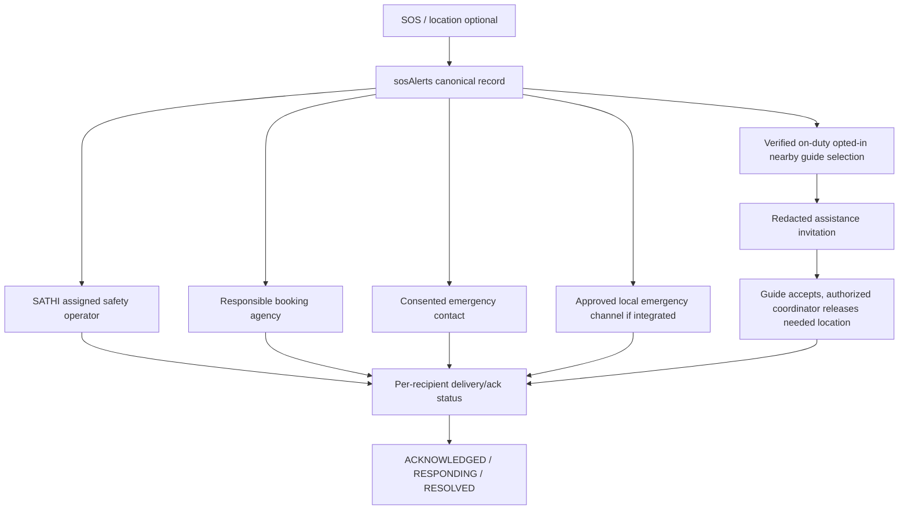

# Safety, moderation, trips and emergency operations

Target only. Preserve existing sosAlerts/reportService/support/SafetyWidget and honest record-only acknowledgement. Billing or a push message does not establish staffed response. Advanced SOS dispatch stays disabled until operations has named responders, coverage hours, escalation SOPs and supervised drills.

## Messaging moderation and consent

New gated send command uses existing conversations/messages and immutable membership, backend entitlement check, registered phone/adult eligibility for protected context, mutual block, length/rate checks and contact-risk classification before persisted delivery. A block prevents new request/message in both directions immediately; history remains private subject to evidence policy. Global account suspension can block all new sends. New direct-client write bypass must be denied at coordinated migration; do not rely on MessagesTab's current two-message UI rule.

Detect contact sharing with contextual rules: phone-like digit sequences including Nepal/country patterns and obfuscation, email, WhatsApp/Telegram/social links, handles in invitation context. Legitimate time, booking ID, price or ordinary numeric message should pass; test Nepali/English/Unicode digits and false positives. Disallowed contact sharing before agreed platform entitlement warns and offers in-app alternative; repeated/strong scam or off-platform payment signals may block/queue. Rules-based classifier can evolve to reviewed model, but never labels a user criminal from a keyword. Harassment, sexual solicitation, drugs, violence and abuse signals use severity/confidence/context and appeal.

`reports` extends caseType=USER_REPORT|AUTOMATED_SIGNAL|INCIDENT, source message/booking ID, classification, evidence pointer, version, assigned role, action and retention hold. Store private evidence separately from public message docs; moderated sender sees safe reason, not investigative thresholds. Signal → classify → warn/block/queue → audit record → repeat escalation → human investigation → resolve/appeal. Moderator access is assigned-case, audited and time-limited; admin UI presence alone grants nothing. Contact filter is best-effort harm reduction, never perfect off-platform bypass prevention.

## Trip consent and location

Reuse `booking_locations/{bookingId}` as trip safety session, not a parallel permanent tracking identity. Version2 adds subject participants, booking/agency snapshot, status OFF|CONSENTED|ACTIVE|STOPPED|EXPIRED, consentVersion, consentedAt, revokedAt, allowedViewerIds/roles, startedAt/endAt, retentionUntil, latest coarse/precise location ref. Only confirmed active eligible trip can activate; service-start QR does not imply location consent.

UI explicit “Trip Safety Tracking ON”, pause/stop, viewers, sampling and expiry explanation. Propose samples no faster than60 seconds while active, reduce when stationary/low battery; upload bounded batches max20, sequence/device session IDs dedupe, discard samples outside signed consent/time window. No continuous pre-trip or post-trip tracking. Backend rejects new points after revoke/end; scheduled closure plus request-time expiry guards, not dependence on scheduler punctuality. Native background permission requires platform-specific opt-in/device tests; PWA background delivery not guaranteed. Missing/stale location shows last updated and accuracy, never “live”.

`locations/{randomId}` Timestamp, accuracy, lat/lng, sequence, consent/session ref; no public reads. Retain raw points proposed7 days after trip, then delete via bounded verified job unless incident legal hold. Latest point cleared after termination/retention; deidentified route analytics only by consent and aggregation. These are engineering defaults requiring owner/privacy approval, not statutory periods. Trusted contact share grant expires at trip end, revocable, narrow target; bearer share token hash only, no public coordinate URL. Access check on every read.

## SOS flow

Alert states preserve existing `active` with version adapter → ACTIVE → ACKNOWLEDGED → RESPONDING → RESOLVED; user CANCEL_REQUESTED does not erase dispatched incident, operator confirms CANCELLED and notifies responders. No auto-dismiss. Alert records offline submission as unsent until server acknowledgement; show direct local emergency guidance only with verified current details, not fabricated numbers. Do not send test emergencies to real responders.

Dispatch `sosAlerts/{id}/deliveries/{recipientKey}` records target role/channel, queued/sent/acknowledged/failed, attempt and dedupe IDs. Push sent ≠ received ≠ responder accepted. Retry/escalation timer uses configurable coverage policy; if no staffed route available, UI explicitly states no monitored response and offers safe owner-approved alternatives. Current client has record-only functionality; this target must not change that claim prematurely.

Nearby guide selection: bounded geohash/service-area candidates, verified guide and identity, current agency/capability, active not suspended, on-duty/available, fresh location availability opt-in, inside configured radius and no block/conflict. Radius is required config before enabling dispatch, no speculative default. Send redacted approximate-area request first; exact coordinates only to accepted assigned responder with current purpose-bound grant. Agency finance/ordinary partner staff/public feed get no emergency coordinates.

Retention schedule: public content per user deletion/moderation; raw trip points7days proposed; ordinary closed reports90days proposed; verification document evidence after decision/appeal proposed90days where lawful; financial journals provisional7years pending counsel/provider requirements. Store per-class policy version and legalHold; no deletion job activated until owner approves applicable retention. Financial records may require pseudonymous preservation after account deletion; public profile removed without deleting required audit. Track exports/access and erase derivative caches, not only primary doc. Never promise immediate recall of already-issued public Storage tokens.

Tests: consent deny/revoke, wrong booking/UID/agency, end/expiry concurrent upload, stale/poor GPS, background/offline limits, crossed tenant delivery, responder decline/no coverage, replayed SOS, user cancellation after dispatch, safe ordinary numeric messages, obfuscated contact, false-positive appeal, evidence hold versus deletion. Preserve SafetyWidget record-only tests until advanced feature is specifically enabled; no emergency response SLA without operational drills and owner sign-off.
