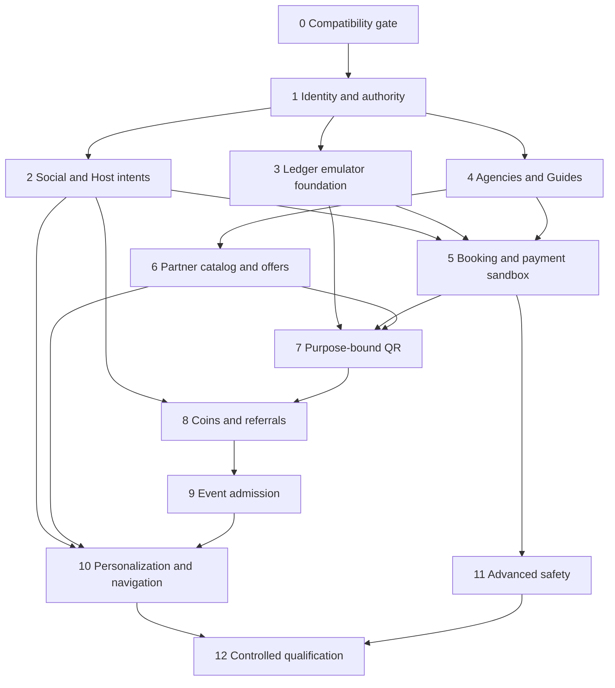

# Implementation roadmap and phase prompts

Target plan v1, 2026-09-10. Architecture/design only: **none of these new phases is implemented or approved for production by this document**. Existing completed repairs remain existing work, not completion of a new phase. Owner approval selects one bounded phase; implementation does not authorize deployment or money activation.

> **Status update, 2026-09-12:** The Phase 0 evidence baseline is complete and its P0-01 messaging/favorites containment follow-up is active with dedicated-account production acceptance. See [DOCUMENTATION_STATUS.md](DOCUMENTATION_STATUS.md) and [MESSAGING_RELEASE_RESULT.md](MESSAGING_RELEASE_RESULT.md). P0-02 onward and every numbered target phase below remain unimplemented unless a later release record says otherwise.

## Priority and dependency order

P0: reconcile production security/version drift, prevent authority bypass and data loss, protect private evidence, make financial commands fail closed. P1: identity/eligibility, accepted messaging, tenant isolation, tested booking/payment contracts and staffed operational readiness. P2: expanded monetization and ranking after prerequisites. P3: optional AI and visual polish after deterministic/device acceptance. Cash redemption and deeper referral rewards are conditional compliance gates, not mandatory launch shortcuts.



This is dependency sequencing, not permission to implement all phases. Basic reports/blocks/contact safety belongs in Phase 2; advanced tracking is Phase 11. Existing free Events compatibility can be released independently after Phase 0's separately approved scoped review; do not wait for paid Events to repair a current core defect. Phase 3 is independently testable while nonfinancial tenant work progresses, without requiring multiple agents.

## Delivery contract applying to EVERY phase

Read AGENTS.md, [handoff](ANTIGRAVITY_HANDOFF.md), [target](20_TARGET_ARCHITECTURE.md), [permissions](21_ROLE_CAPABILITY_MATRIX.md), [registry](31_DATA_CONTRACTS.md) and the selected domain document before changes. Verify actual imports/paths and worktree first; preserve unrelated work. Paths below are expected scope, not blanket permission. New paths are proposed; if an equivalent module exists, extend it and record that mapping instead of creating a duplicate. Shared contracts contain pure validation/types and no Firebase initialization.

Every delivery records: issue/evidence, root cause, file diff, schema/rules/index semantic diff, tests with actual outputs, migration dry-run, regression risk, rollback, live acceptance not run, and remaining owner decisions. New cloud commands use authenticated actor, config/version, resource/tenant ownership, idempotency and transactional audit. Admin SDK bypasses rules: authorization belongs inside the backend too. No new financial or authority truth in AppContext/localStorage.

Every phase requires unit validation plus relevant negative emulator tests; new ordered queries require exact field/direction/index definitions and bounded cursors. Emulator success does not verify live composite indexes. No production destructive testing. No real provider calls in retryable Firestore transactions. Do not install/deploy Functions until current billing and deployment authority are explicitly confirmed.

Proposed tests/integration paths below require an explicit isolated integration runner/config, reusing the current ops emulator harness where possible; the main src/__tests__ include does not discover them automatically. Record the actual command and executed test names. Do not claim new tests passed merely because an existing unrelated suite ran.

Typical baseline commands (inspect configs and dependency availability first):

```powershell
npx vitest run --config vitest.config.ts
npx tsc --noEmit
npm run build
node scripts/check-booking-policy.mjs
```

Run admin tests/build from admin with its own config and Functions TypeScript from functions using its actual scripts (`npm run build` is tsc, not deploy). Integration gates use the repository's emulator config and an isolated demo project, never production credentials; inspect existing integration scripts before selecting a command. Current main/admin configs explicitly include their respective src/__tests__ directories, correcting older overlapping-discovery notes. Preserve that isolation and record included files rather than add historical counts. A failing unrelated baseline is recorded, not silently suppressed.

Feature rollout: compare current deployed rules to exact candidate, preserve rollback source, test unrelated branches, verify indexes READY, stage compatible handlers, release app/flags/cohort, read back deployment, then positive and cross-user negative acceptance. Do not copy a legacy insecure rollback over new money authority. Rollback stops new work and preserves reconciliation/history; journal corrections are compensating entries.

## Phase specifications

### Phase 0 — Production compatibility and security baseline

- **Goal:** Establish the exact deployed contract and a safe, reviewable starting point before expansion.
- **Business rules:** Treat deployed rules, root rules and ops candidates as different versions. Do not deploy root or legacy Functions wholesale. Preserve current users, UIDs, media, comments, bookings and chat history.
- **Reuse:** Existing scoped rollout tooling, rollback copies, comment/media/Event gate tests and release reports.
- **Existing files expected to change/inspect:** firestore.rules; storage.rules; ops/media-rollout/; scripts/; src/services/bookingTransactions.ts (inspect only initially).
- **New files/modules proposed:** docs/sathi/PHASE_00_COMPATIBILITY_REPORT.md; tests/integration/architecture-baseline.test.ts (if absent).
- **Firestore, rules, indexes and backend:** Read-only fresh production rules/index/handler inventory; compare normalized semantics and save rollback copies. List insecure legacy branches and pending Event differences separately. No database writes or deployment in the first task.
- **UI work:** No UI changes. Inspect guest and owner compatibility; signed-in acceptance only with authorized disposable fixtures.
- **Permissions:** Test unauthenticated, owner, stranger, ordinary admin and restricted-user cases; document retained broad conversation/favorite grants and duplicate local allow branches.
- **Migration and preservation:** Inventory schemas by bounded redacted samples/counts; propose adapters and dry runs. Do not normalize data or remove samples yet.
- **Tests and verification:** Run isolated main/admin suites, booking-policy check and relevant Firebase emulator scopes; establish actual counts. Verify public comments/media queries against READY indexes; identify legacy Functions overwrites and App Check/PWA gaps.
- **Edge cases:** Production changes during capture; unavailable access; old installed PWA; mismatched root candidate. Stop comparison if hashes change.
- **Failure handling:** Record unknowns and blockers rather than assuming CLI/build success establishes live behavior.
- **Definition of done:** Source/deployed manifest, semantic diff, rollback artifacts, baseline test evidence, prioritized containment plan and explicit unresolved live checks reviewed. Any fix/release requires a narrowly approved follow-up.
- **Must NOT touch:** No blanket rules deploy, Functions deploy, billing change, CORS edit, security weakening, app feature work or data migration.
- **Dependencies:** None. Deployment credentials are needed only for fresh read-only production verification.
- **Domain reading:** 20_TARGET_ARCHITECTURE.md, 21_ROLE_CAPABILITY_MATRIX.md, 31_DATA_CONTRACTS.md, MEDIA_SOCIAL_RELEASE_RESULT.md, FOCUSED_EVENTS_NAVIGATION_RESULT.md

### Phase 1 — Identity, capabilities and verification foundation

- **Goal:** Make one UID and a backend-authoritative eligibility snapshot the shared source for all service modes.
- **Business rules:** Separate human identity, capabilities, badges, tenant roles and commercial eligibility. No automatic conversion of historical isVerified into every badge. Authority updates and audit must commit atomically.
- **Reuse:** profileBootstrap, identity helpers, CompanionApplicationRepository, existing private KYC workflow and standalone staff RBAC.
- **Existing files expected to change/inspect:** src/services/identity.ts; src/services/profileBootstrap.ts; src/repositories/CompanionApplicationRepository.ts; src/context/AppContext.tsx (confirm actual path); admin/src/services/admin.ts; functions/src/index.ts (select exports only).
- **New files/modules proposed:** shared/contracts/identity.ts; functions/src/domains/identity/; functions/src/domains/config/; src/services/capabilities.ts; tests/integration/capabilities.test.ts.
- **Firestore, rules, indexes and backend:** Add users/{uid}/access/current, typed verification_requests extensions and platform_config versions. Rules deny client authority fields; private Storage verified against production. C2/C3 indexes only when queried. New commands independently exported behind disabled flags.
- **UI work:** Reuse application forms; show separate phone/adult/identity badges and missing requirements, not a new account per role.
- **Permissions:** Own editable fields allowlisted; reviewers assigned scope only; agency staff cannot inspect personal KYC. Backend rechecks access version and config.
- **Migration and preservation:** Dry-run legacy capability mapping with explicit evidence; keep role compatibility. Existing approved users retain historical badge until evidence review, not silently new financial eligibility.
- **Tests and verification:** Auth switch during bootstrap, duplicate approval, partial-failure rollback, self-promotion, revoked reviewer, stranger KYC read, expired credential and missing-config denial.
- **Edge cases:** Existing companion ID not UID; unverifiable legacy age; conflicting IDs; reviewer changes during approval.
- **Failure handling:** Fail closed for new capability grants while preserving safe browsing/account recovery.
- **Definition of done:** One atomic authority command, public/private projection tests and documented migration report; feature off until scoped release review.
- **Must NOT touch:** Do not enable wallet, regulated bookings or broad claims replacement; no automatic existing-user suspension based solely on missing migrated fields.
- **Dependencies:** Phase 0 baseline and explicit KYC process/age-evidence owner policy.
- **Domain reading:** 20_TARGET_ARCHITECTURE.md, 21_ROLE_CAPABILITY_MATRIX.md, 22_AGENCY_GUIDE_ARCHITECTURE.md, 31_DATA_CONTRACTS.md

### Phase 2 — Free Friend, Local Host and messaging entitlements

- **Goal:** Ship distinct nonfinancial social/host flows and one shared companion row selection engine.
- **Business rules:** Free Friend service is NPR0. First five distinct full-profile grants per Nepal day; reopening a grant costs nothing. Coin unlock remains unavailable until Phase 8. Accepted context—not a client message count—authorizes new contact.
- **Reuse:** Existing companion discovery, companionRows, feedGenerator, messaging history, preferences and application screens.
- **Existing files expected to change/inspect:** src/components/discovery/companionRows.ts; src/services/feedGenerator.ts; src/hooks/useDiscoveryFeed.ts; src/services/messaging.ts; src/components/messages/MessagesTab.tsx; src/repositories/CompanionRepository.ts.
- **New files/modules proposed:** shared/contracts/serviceModes.ts; functions/src/domains/discovery/; functions/src/domains/hangouts/; functions/src/domains/messaging/; src/services/profileAccess.ts; tests/integration/hangout-entitlements.test.ts.
- **Firestore, rules, indexes and backend:** Add provider_settings, profile_unlocks, discovery_usage, hangout_requests, blocks and conversation entitlements. Backend sends new gated messages; keep top-level messages. C1/C11/C19 plus bounded history pagination.
- **UI work:** Free Friend/Host mode selectors, consent request/accept, honest daily limit, contextual contact warnings. Shared FeedBlock companion row IDs on desktop/mobile/PWA, responsive wrapping only.
- **Permissions:** Adult/phone/standing and both-side blocks checked server-side. Full private profiles returned only by entitlement endpoint; no hidden fields in public teasers. Existing generic chat route cannot bypass new-send gating.
- **Migration and preservation:** Preserve conversations and historical messages; explicit legacy entitlement policy for existing pairs, never erase history. Move desktop extra row selection into shared service with fixture parity.
- **Tests and verification:** Sixth free discovery denied; concurrent fifth grant; reopen next day; midnight Kathmandu; accept/reject/block races; ordinary numbers not blocked as contact; cross-user grants; same feed row IDs at all breakpoints.
- **Edge cases:** Sparse categories fewer than three; revoked access after unlock; offline send; existing conversation without new context.
- **Failure handling:** No optimistic success for failed requests/messages; retry stable IDs; preserve draft and display reason.
- **Definition of done:** Real distinct service intents, backend-gated contact, bounded chat windows and responsive data parity demonstrated; commerce still off.
- **Must NOT touch:** No dating redesign, Free Friend service charge, paid unlock debit, new conversation database or Story comments.
- **Dependencies:** Phase 1. Host paid checkout waits for Phase 5; basic safety/blocking must not wait for Phase 11.
- **Domain reading:** 21_ROLE_CAPABILITY_MATRIX.md, 22_AGENCY_GUIDE_ARCHITECTURE.md, 27_RECOMMENDATION_ARCHITECTURE.md, 28_SAFETY_TRIP_ARCHITECTURE.md, 31_DATA_CONTRACTS.md

### Phase 3 — Ledger and financial command foundation

- **Goal:** Prove accounting and concurrency in emulators with all commercial flags disabled.
- **Business rules:** Whole Coins and integer NPR paisa; 10 Coins=NPR1. Immutable balanced journal per operation/asset; atomic projections and source lots. No direct balance edits or P2P; cash redemption off.
- **Reuse:** Existing fail-closed payments interface, audit conventions and Firebase transactions; do not reuse localStorage idempotency as financial security.
- **Existing files expected to change/inspect:** src/services/payments.ts; admin/src/services/audit.ts; functions/src/index.ts (explicit new exports only).
- **New files/modules proposed:** shared/contracts/money.ts; functions/src/domains/ledger/; functions/src/domains/operations/; functions/src/domains/reconciliation/; tests/integration/ledger-concurrency.test.ts.
- **Firestore, rules, indexes and backend:** Add ledger_transactions, wallet_accounts/lots/statement, operations, payment_receipts and reconciliation_runs. Client writes denied. C14 and bounded lot/statement indexes. Journals use operationId_asset; both asset journals commit together.
- **UI work:** No live purchase/withdraw controls; optional developer-only emulator statement harness. Existing unavailable UI remains truthful.
- **Permissions:** Owner minimized statements; finance audit scoped; requester/approver separation and backend authority. All new functions validate auth/tenant/config because Admin SDK bypasses rules.
- **Migration and preservation:** No starting balances from diamonds/demo rewards. Empty financial accounts only; any funded opening balance needs separate signed source reconciliation.
- **Tests and verification:** Parallel spend/reserve, duplicate request/different intent, balanced assets, overflow/fraction denial, 20-lot cap/consolidation, source eligibility, immutable journals, reversal twice, cache replay and crash recovery.
- **Edge cases:** Lost response after commit; mixed eligible/ineligible lots; chargeback after spend; stale config and disabled flag mid-operation.
- **Failure handling:** UNKNOWN remains reserved pending reconciliation; never release or retry an external payment blindly.
- **Definition of done:** Replayable emulator ledger and race tests, approved chart-of-accounts proposal and all flags verified off.
- **Must NOT touch:** No real provider initiation, rewards, withdrawals, balance migration or production money movement.
- **Dependencies:** Phase 1 authority/config; finance review before any subsequent activation.
- **Domain reading:** 24_WALLET_LEDGER_ARCHITECTURE.md, 21_ROLE_CAPABILITY_MATRIX.md, 31_DATA_CONTRACTS.md

### Phase 4 — Agencies, guides and packages

- **Goal:** Implement verified tenant operations and one active primary agency per guide without duplicate identities.
- **Business rules:** Regulated guide work requires verified agency and guide. Guide consent required; agency controls final price. Transfer preserves historical affiliation and booking responsibility.
- **Reuse:** Existing application/reviewer workflows, standalone admin routing/RBAC, companion catalog and cities.
- **Existing files expected to change/inspect:** src/repositories/CompanionApplicationRepository.ts; admin/src/services/admin.ts; admin/src/repositories/AdminRepository.ts (confirm path); admin/src/App.tsx.
- **New files/modules proposed:** shared/contracts/organizations.ts; functions/src/domains/organizations/; functions/src/domains/verification/; admin/src/pages/agencies/; tests/integration/guide-affiliation.test.ts.
- **Firestore, rules, indexes and backend:** Add agencies/private, organization_memberships/invitations, guide_affiliations, identity_keys, agency_packages/priceVersions. C3–C9 as required. Atomic primary pointer and active affiliation. Private credential Storage branch separately reviewed.
- **UI work:** Agency owner/staff dashboard, invite claim, guide agency consent/transfer, licence expiry, package and price approval; reuse existing visual language.
- **Permissions:** Tenant roles scoped by membership; no cross-agency roster/price/KYC access. Invitation never creates agency-known password. PRICE_CHANGE documents exclude private application fields.
- **Migration and preservation:** Map verified legacy guideApplications only after evidence/UID review; unmatched records remain legacy. No automatic transfer or bulk agency assignment.
- **Tests and verification:** Simultaneous two-agency activation, replayed/expired invitation, email/contact mismatch, two credentials one UID, same credential two UIDs, staff revocation, expiry grace vs critical prohibition.
- **Edge cases:** Guide leaves with future bookings; agency suspension; ownership recovery; credential key rotation/collision review.
- **Failure handling:** Leave application pending with auditable reason; never half-activate relationship or publish unapproved price.
- **Definition of done:** Atomic affiliation invariants, tenant isolation and agency package price snapshots verified; no regulated live checkout yet.
- **Must NOT touch:** No direct-guide regulated payment path, shared staff accounts, plaintext national IDs or new Firebase project.
- **Dependencies:** Phase 1; owner-reviewed licence policy, credential normalization and private document retention.
- **Domain reading:** 22_AGENCY_GUIDE_ARCHITECTURE.md, 21_ROLE_CAPABILITY_MATRIX.md, 31_DATA_CONTRACTS.md

### Phase 5 — Booking v3 and verified provider payments

- **Goal:** Add typed commercial booking transitions and provider sandbox verification over existing reservation architecture.
- **Business rules:** Canonical booking ID; service/payment/review/safety states separate. Agency snapshot for regulated trips. Verified provider receipt—not redirect—confirms funds; no escrow claim. Disclosed cancellation snapshot controls refunds.
- **Reuse:** bookingTransactions day locks/idempotency, bookingPolicy v2 adapter, PaymentProvider Khalti/eSewa interface and booking UI.
- **Existing files expected to change/inspect:** src/services/bookingTransactions.ts; src/services/bookingPolicy.ts; src/services/bookingEligibility.ts; src/services/payments.ts; src/components/modals/BookingFlowModal.tsx; src/services/reviews.ts.
- **New files/modules proposed:** shared/contracts/bookingsV3.ts; functions/src/domains/bookings/; functions/src/domains/payments/; functions/src/domains/reviews/; tests/integration/booking-v3.test.ts.
- **Firestore, rules, indexes and backend:** Extend bookings/booking_locks with versioned quote/hold/state. Persist payments/refunds/settlements; canonical reviews. C12/C13/C16/C18. Server-only v3 mutations, preserve proven v2 cohort until coordinated cutover.
- **UI work:** Mode/agency-specific quote, pending verification, cancellation/refund status and completed-experience review. Never label v2 confirmed as paid.
- **Permissions:** Customer owns intent; host/agency assigned authority; no self-booking or arbitrary payee; finance cannot approve own refund/adjustment.
- **Migration and preservation:** v2 remains explicit unpaid-acceptance adapter; no rewriting existing booking policy. Hold expiry introduced only with compatible old-writer gate and resumable release worker.
- **Tests and verification:** Same-day competing reservations, multi-day lock ordering, duplicate provider receipt, wrong currency/amount/merchant/order, timeout and late verified receipt, 24h/6h boundaries, partial refund, one review per completed verified experience.
- **Edge cases:** Licence expires after reservation; user blocked after payment; provider outage; trip dispute; provider lacks payout/refund capability.
- **Failure handling:** UNKNOWN reconciles; late payment cannot reclaim sold seat; refund obligation persists when new commerce disabled.
- **Definition of done:** Sandbox end-to-end booking/refund/reconciliation plus emulator isolation; controlled live pilot requires separate provider, legal and owner release approval.
- **Must NOT touch:** No blanket legacy function activation, real cash release, claim of escrow or replacement booking collection.
- **Dependencies:** Phases 1/3/4 for Guide; Phase 2 Host flow. Merchant sandbox credentials and owner-approved commission/refund terms.
- **Domain reading:** 22_AGENCY_GUIDE_ARCHITECTURE.md, 24_WALLET_LEDGER_ARCHITECTURE.md, BOOKING_STATE_MACHINE.md, 31_DATA_CONTRACTS.md

### Phase 6 — Partner businesses and offers

- **Goal:** Extend the existing partner catalog with verified ownership, staff and approved commercial offers.
- **Business rules:** Separate owner/manager/staff. Discount/cashback terms, funding base and commission must be versioned, reviewed and bounded by budget/quota.
- **Reuse:** partners/cities/venues catalog and standalone tenant/admin capabilities from Phase 4.
- **Existing files expected to change/inspect:** src/hooks/useFirestoreData.ts; admin/src/services/admin.ts; admin/src/App.tsx (existing partner route wiring).
- **New files/modules proposed:** functions/src/domains/partners/; shared/contracts/partnerOffers.ts; admin/src/pages/partners/; src/services/partnerOffers.ts; tests/integration/partner-offers.test.ts.
- **Firestore, rules, indexes and backend:** Extend partners/private/compliance and immutable agreements; add partner_offers/versions. C4/C10. Public only approved businesses/published offers, backend writes.
- **UI work:** Catalog detail, menu/hours/services, offer conditions, staff and approval dashboard; no working redemption claim before Phase 7.
- **Permissions:** Staff cannot set agreements or approve own business; tenant assignments and owner recovery audited.
- **Migration and preservation:** Reuse existing partner IDs; crosswalk hotels/restaurants/cafes only when real duplicates proven. No catalog bulk delete.
- **Tests and verification:** Cross-tenant staff/read/write denial, invalid discount percentage, fixed discount beyond bill cap, unfunded cashback, overlapping terms, expiry and suspension.
- **Edge cases:** Business owner changes; business closes with redemption liability; offer rate changes while customer holds quote.
- **Failure handling:** Offer publication fails closed if funding or agreement missing; existing factual catalog remains usable.
- **Definition of done:** Verified tenant isolation, versioned offers and bounded area catalog; redemption disabled.
- **Must NOT touch:** No POS trust in customer-entered amount, payout launch or replacement business identity.
- **Dependencies:** Phases 1/4 tenant infrastructure; Phase 3 only for funded offer validation, no ledger posting yet.
- **Domain reading:** 23_PARTNER_QR_ARCHITECTURE.md, 21_ROLE_CAPABILITY_MATRIX.md, 31_DATA_CONTRACTS.md

### Phase 7 — One-time QR redemption and service start

- **Goal:** Use one purpose-bound backend token system for Partner transactions and verified trip start.
- **Business rules:** 600-second expiry; random nonce stored hashed; partner/booking/user/purpose/version binding. Staff confirms/corrects bill; finalization, quota, budget, receipt and journal references are atomic.
- **Reuse:** Phase 5 booking/payment state, Phase 6 offer versions and Phase 3 operations/ledger.
- **Existing files expected to change/inspect:** src/components/modals/BookingFlowModal.tsx (start entry only); admin/src/App.tsx; functions/src/index.ts (scoped exports).
- **New files/modules proposed:** functions/src/domains/qr/; shared/contracts/qr.ts; src/components/qr/; admin/src/pages/partners/PartnerScanner.tsx; tests/integration/qr-replay.test.ts.
- **Firestore, rules, indexes and backend:** Add qr_sessions, partner_redemptions, offer_usage. C17 and state/expiry cleanup query. Tokens server-only; finalized receipts scoped. Purpose dispatch allowlist, no arbitrary target path.
- **UI work:** QR timer/cancel/regenerate, staff confirmation with actual bill and disclosed discount, receipt; trip start distinct from payment completion.
- **Permissions:** Customer cannot finalize own bill; wrong partner/staff/guide/purpose denied; revoked staff rechecked at consume.
- **Migration and preservation:** No fabricated redemption import; existing booking can use start token only through eligible version adapter.
- **Tests and verification:** Double scan race, screenshot replay, expiry boundary, regenerated old token, wrong partner/purpose, corrected bill exceeds reservation, quota contention, partial failure and retry after committed response loss.
- **Edge cases:** Offline scanner, clock skew, screenshot relay, token expires during confirmation, offer suspended while hold exists.
- **Failure handling:** Offline no success; consumed retry returns original result; timeout releases budget only through guarded state transition.
- **Definition of done:** Emulator races and controlled two-actor sandbox scan demonstrate exactly-once effects; live rewards still separately gated.
- **Must NOT touch:** No QR-embedded authority amount, reusable plaintext secret, real payout or physical-presence guarantee.
- **Dependencies:** Phases 3/5/6; camera/device acceptance; explicitly funded cashback policy before posting any live reward.
- **Domain reading:** 23_PARTNER_QR_ARCHITECTURE.md, 24_WALLET_LEDGER_ARCHITECTURE.md, 28_SAFETY_TRIP_ARCHITECTURE.md, 31_DATA_CONTRACTS.md

### Phase 8 — Coins and qualified referrals

- **Goal:** Activate separately gated funded coin earning/spending and bounded qualified attribution.
- **Business rules:** No P2P, no coin expiry; minimum potential cash redemption 5000 Coins but cash flag remains OFF. Direct verification reward only if approved; deeper levels reward completed qualified activity only, max5. No recruitment-chain payouts.
- **Reuse:** Phase 3 ledger/lots, Phase 2 profile grants, verified events from Phase 5/7 and provider sandbox adapters.
- **Existing files expected to change/inspect:** src/services/payments.ts; src/services/preferences.ts; existing Wallet/referral UI route components (resolve current imports).
- **New files/modules proposed:** functions/src/domains/referrals/; functions/src/domains/rewards/; src/services/wallet.ts; shared/contracts/rewards.ts; tests/integration/referral-rewards.test.ts.
- **Firestore, rules, indexes and backend:** Add referral_codes/referrals/rewards; C15 and bounded parent attribution query. Reward source dedupe and cap reservation atomic with ledger. Separate purchase/earn/spend/deepReferral/cash flags.
- **UI work:** Unified coin statement, truthful earnings/held/reversed states, purchase only when merchant-approved; show unlock as platform fee, not person payment.
- **Permissions:** Adult/standing/source eligibility verified server-side; no client ancestor list, reward rate or balance authority; staff cannot inspect full private referral graph without case scope.
- **Migration and preservation:** No fake engagement qualification or demo balances. Attribution immutable from validated invitee registration ordinal; existing accounts no retroactive parent without approved migration policy.
- **Tests and verification:** Cycles including >5 length, self-referral, shared-device review, repeated qualified event, cap race, refunded source reversal, paid unlock concurrency, source cash ineligibility and chargeback freeze.
- **Edge cases:** Missing ancestor, suspended ancestor, policy changes, no eligible funding, purchaser refund after coin spend.
- **Failure handling:** Hold suspect reward with appeal; never hide failed spend behind local balance. Refund corrections are journal reversals.
- **Definition of done:** Funded source-to-statement audit and negative tests; every activation recorded by feature/cohort. Deep rewards/cash remain off absent explicit legal approval.
- **Must NOT touch:** No automatic multi-level activation, cash payout, money tips/gifts workaround or recruitment promise.
- **Dependencies:** Phases 2/3/5/7 as applicable source; owner-reviewed costs/caps/funding and merchant/compliance approval.
- **Domain reading:** 24_WALLET_LEDGER_ARCHITECTURE.md, 25_REFERRAL_ARCHITECTURE.md, 27_RECOMMENDATION_ARCHITECTURE.md, 31_DATA_CONTRACTS.md

### Phase 9 — Moderated Events and admission

- **Goal:** Extend existing Events with eligible publishing and reliable free/Coin/NPR admission.
- **Business rules:** Preserve Event comments/likes. Phone/adult/standing/account-age/creator eligibility; configured publication cost reserved then consumed/released. Joined+held<=capacity. Tombstone preserves attendees and financial obligations.
- **Reuse:** EventActions, CreateEventModal, eventParticipationCore, mediaSocial receipts and current membership IDs.
- **Existing files expected to change/inspect:** src/services/eventParticipationCore.ts; src/services/eventContract.ts; src/components/events/EventActions.tsx; src/components/modals/CreateEventModal.tsx; functions/src/mediaSocial.ts (preserve existing ownership).
- **New files/modules proposed:** functions/src/domains/events/; shared/contracts/eventAdmissions.ts; tests/integration/event-admissions.test.ts.
- **Firestore, rules, indexes and backend:** Extend events/reservedSeatCount and add event_admissions deterministic user/Event intent with attemptVersion. Update free join compatibility before paid holds coexist. Only needed upcoming/hold-expiry indexes.
- **UI work:** Draft/review/rejection states, price type, admission pending/confirmed/refund, organizer attendee summary without public personal roster.
- **Permissions:** Owner bounded drafts, authorized moderators only protected fields, backend paid finalization. Suspended organizer cannot create/join around restrictions.
- **Migration and preservation:** Dry-run legacy capacity reconciliation; records without authoritative count/version remain nonjoinable. Existing membership and payment history retained.
- **Tests and verification:** Last-seat free vs paid race, repeat join/leave, delayed callback from previous attempt, cancellation refund, moderation fee release once, revoked creator and private attendee denial.
- **Edge cases:** Lowering capacity below occupants; cancellation with UNKNOWN payment; expired hold with late payment; Event ended during checkout.
- **Failure handling:** Explicit pending state, reconcile/refund late funds; no fabricated attendance or successful offline booking.
- **Definition of done:** Existing Event regressions plus admission/concurrency/sandbox flow pass; scoped coordinated release review.
- **Must NOT touch:** No new Event product/collection, Story comments, unreviewed publish-cost default or unsafe old free writer.
- **Dependencies:** Phase 0 validates existing Event rollout separately; Phases 1/3/5/8 for new paid/coin expansion.
- **Domain reading:** 26_EVENTS_ARCHITECTURE.md, 24_WALLET_LEDGER_ARCHITECTURE.md, 31_DATA_CONTRACTS.md

### Phase 10 — Personalization and product navigation

- **Goal:** Introduce optional onboarding and explainable bounded ranking while preserving shared responsive composition.
- **Business rules:** Eligibility first; deterministic ranking before optional AI. Four pools max20 each, return<=20 with cursor/config snapshot; sparse genuine results are valid. AI may only reorder eligible real IDs.
- **Reuse:** feedGenerator, useDiscoveryFeed, existing routes, preferences, shared companion rows and current logo/tokens.
- **Existing files expected to change/inspect:** src/services/feedGenerator.ts; src/hooks/useDiscoveryFeed.ts; src/services/preferences.ts; src/components/discovery/DiscoveryFeed.tsx; src/App.tsx; src/index.css.
- **New files/modules proposed:** shared/contracts/feedBlocks.ts; functions/src/domains/recommendations/; src/components/onboarding/; src/services/recommendations.ts; tests/integration/recommendation-budget.test.ts.
- **Firestore, rules, indexes and backend:** Extend preferences and add discovery_feedback; C1/upcoming Events/local offer indexes already justified. Backend bounded candidates, no collection scans or per-card listeners.
- **UI work:** Optional interests/locality/travel choices; proposed For You/People/Explore/Messages/Profile mobile structure requires owner approval before route-shell change. Keep deep links and logo-led light/dark tokens; no new rebrand.
- **Permissions:** Private interests not public; no KYC/location/referral graph to AI. Backend eligibility and block filters cannot be overridden by ranker.
- **Migration and preservation:** Version optional preferences; no mandatory onboarding lockout. Existing URLs redirect compatibly only after route tests.
- **Tests and verification:** Same source window/row IDs desktop/mobile/PWA, page budget, cursor duplicates, withdrawn profiles, sparse region, AI invalid IDs/outage, reduced motion/focus/contrast and deep-link reload.
- **Edge cases:** Moving locality mid-page, config version change, hidden/restricted item revalidation, no candidate data.
- **Failure handling:** Deterministic fallback, real empty state and preserved scroll; never demo fallback or invented profiles.
- **Definition of done:** Bounded query budgets and device layout acceptance; owner-approved navigation mapping and no new data source divergence.
- **Must NOT touch:** No model-first feed, forced onboarding, speculative national data download or removal of booking/history routes.
- **Dependencies:** Phases 2/4/6/9 provide eligible candidates; owner approves proposed navigation before implementation.
- **Domain reading:** 27_RECOMMENDATION_ARCHITECTURE.md, 29_PRODUCT_INFORMATION_ARCHITECTURE.md, 32_DESIGN_TOKENS.md, 31_DATA_CONTRACTS.md

### Phase 11 — Advanced trip safety and SOS operations

- **Goal:** Add consent-scoped trip sharing and real acknowledgement-based safety operations without overstating response.
- **Business rules:** Separate safety state from service/payment. Explicit expiring location consent; trip/tenant/case least privilege. SOS record creation is not rescue or dispatcher acknowledgement.
- **Reuse:** sos.ts, SafetyWidget, dormant locationTracking/booking_locations, reports and basic block/moderation from Phase 2.
- **Existing files expected to change/inspect:** src/services/sos.ts; src/services/locationTracking.ts; src/components/SafetyWidget.tsx; admin/src/pages/ (existing SOS route); android/app/src/main/AndroidManifest.xml; ios/App/App/Info.plist (only after platform plan).
- **New files/modules proposed:** functions/src/domains/safety/; functions/src/domains/tripLocation/; shared/contracts/safety.ts; admin/src/pages/safety/; tests/integration/safety-consent.test.ts.
- **Firestore, rules, indexes and backend:** Extend sosAlerts and deliveries; reuse booking_locations/locations; trusted_contacts private. Bounded time/session/assigned-case queries; approved retention worker with holds, no mass delete.
- **UI work:** Consent, start/stop and expiry status; SOS queued/sent/acknowledged/failed; customer/agency/trusted-contact views. Native permissions justified separately; browser background limits explicit.
- **Permissions:** Unassigned staff/strangers/expired guide relationship cannot track; opt-in nearby qualified responders only with configured radius; no public exact coordinates.
- **Migration and preservation:** Legacy active SOS is unacknowledged until actual evidence; dormant tracking utility never implies live feature. Retention dry-run first.
- **Tests and verification:** Consent revoke during send, expired trip, cross-tenant location denial, duplicate dispatch, failed channel, offline SOS, background suspension and forged acknowledgement.
- **Edge cases:** Device battery/network loss, agency suspension mid-trip, trusted contact revokes, false alarm, legal hold.
- **Failure handling:** Show local emergency guidance without invented integration; retry/dedupe dispatch, never promise responders.
- **Definition of done:** Staffed sandbox drill and physical-device permission/background tests; truthful limitations and audited access. Live dispatch needs operational owner approval.
- **Must NOT touch:** No unattended emergency launch, guaranteed tracking/rescue or global location access.
- **Dependencies:** Phases 1/2/4/5; verified staffing/escalation contacts, legal retention and provider consent.
- **Domain reading:** 28_SAFETY_TRIP_ARCHITECTURE.md, 21_ROLE_CAPABILITY_MATRIX.md, 31_DATA_CONTRACTS.md

### Phase 12 — Production qualification and controlled release

- **Goal:** Qualify each completed feature independently and release only approved cohorts with recovery evidence.
- **Business rules:** Fresh production safety gate every rules release; indexes READY before queries; coordinated app/handler/rules transitions. Operations can freeze new work but must reconcile in-flight obligations.
- **Reuse:** Scoped release tooling, rollback artifacts, all phase tests, existing Vercel/PWA/Capacitor delivery.
- **Existing files expected to change/inspect:** firebase.media-rollout.json; ops/media-rollout/; vercel.json; vite.config.ts; existing integration suites and deployment scripts (inspect before use).
- **New files/modules proposed:** docs/sathi/PRODUCTION_ACCEPTANCE_MATRIX.md; docs/sathi/RELEASE_RUNBOOK.md; scripts/release-preflight.mjs; tests/integration/cross-domain-release.test.ts.
- **Firestore, rules, indexes and backend:** Readback exact deployed rules/functions/index versions; billing confirmation before new Functions deployment; backups and restore drill. Feature-specific flags and monitoring, no broad config replacement.
- **UI work:** Two-user production acceptance for media, comments, entitlements, booking and admitted Event paths; desktop/mobile/PWA refresh/upgrade and native device checks.
- **Permissions:** Negative stranger/tenant/moderation/ledger cases after deploy with disposable authorized fixtures; App Check enforcement only after valid production tokens and rollout review.
- **Migration and preservation:** Owner-approved dry-run output, bounded compare-and-set batches, checkpoints and rollback reader; no journal delete or broad data purge.
- **Tests and verification:** Main/admin/functions/emulator suites, provider sandbox and explicitly approved low-value live tests, load budgets, concurrency, permission revocation, restored backup, queued external effects, PWA upgrade and observability alerts.
- **Edge cases:** Partial deployment, old clients, index building, provider timeout, exhausted quota, scheduled worker delay, leaked deployment credentials.
- **Failure handling:** Pause new feature cohort, retain compatible rules/history readers and reconciliation; compensate money, never erase it.
- **Definition of done:** Acceptance matrix records verified/failed/not-run for each capability; exact release evidence and owner sign-off. Cash/deep referrals remain off if compliance gates unresolved; conditional features are not blockers to honest noncash launch.
- **Must NOT touch:** No automatic cash activation, production destructive test, risky blanket rollout or claim of complete security from build/test counts.
- **Dependencies:** Only completed approved phases; billing, merchant/compliance and staffed operational gates per feature.
- **Domain reading:** 20_TARGET_ARCHITECTURE.md, 21_ROLE_CAPABILITY_MATRIX.md, 24_WALLET_LEDGER_ARCHITECTURE.md, 28_SAFETY_TRIP_ARCHITECTURE.md, 31_DATA_CONTRACTS.md

## Copyable Antigravity prompts

Use only the selected prompt. Each prompt includes its own scope and stop condition; the linked phase specification is the acceptance contract, not an optional suggestion. Architecture owner review is required between phases.

### Prompt 0 — Production compatibility and security baseline

```text
You are implementing SATHI Phase 0: Production compatibility and security baseline.
Read AGENTS.md, docs/sathi/ANTIGRAVITY_HANDOFF.md, docs/sathi/30_IMPLEMENTATION_ROADMAP.md (common contract and Phase 0), docs/sathi/31_DATA_CONTRACTS.md and these domain docs under docs/sathi/: 20_TARGET_ARCHITECTURE.md, 21_ROLE_CAPABILITY_MATRIX.md, 31_DATA_CONTRACTS.md, MEDIA_SOCIAL_RELEASE_RESULT.md, FOCUSED_EVENTS_NAVIGATION_RESULT.md.
Goal: Establish the exact deployed contract and a safe, reviewable starting point before expansion.
Prerequisites: None. Deployment credentials are needed only for fresh read-only production verification.
Preserve hamrosathi1, one Auth UID per human, existing working routes/data and unrelated worktree changes. Inspect actual imports and reuse existing modules. Do not redesign architecture; report conflicts instead of inventing another schema or source of truth.
Core rules: Treat deployed rules, root rules and ops candidates as different versions. Do not deploy root or legacy Functions wholesale. Preserve current users, UIDs, media, comments, bookings and chat history.
Validate: Run isolated main/admin suites, booking-policy check and relevant Firebase emulator scopes; establish actual counts. Verify public comments/media queries against READY indexes; identify legacy Functions overwrites and App Check/PWA gaps.
Do not: No blanket rules deploy, Functions deploy, billing change, CORS edit, security weakening, app feature work or data migration.
Work only within Phase 0's listed scope. No production deployment, destructive migration, real provider payment or feature activation without separate explicit authorization. A requested implementation phase does not waive the production safety gate.
Deliver a focused diff, actual test evidence, schema/rules/index impact, dry-run/rollback plan, remaining unknowns and CHANGELOG entry. State what was not live-tested. Stop after this phase for architecture review; do not start the next phase.
```

### Prompt 1 — Identity, capabilities and verification foundation

```text
You are implementing SATHI Phase 1: Identity, capabilities and verification foundation.
Read AGENTS.md, docs/sathi/ANTIGRAVITY_HANDOFF.md, docs/sathi/30_IMPLEMENTATION_ROADMAP.md (common contract and Phase 1), docs/sathi/31_DATA_CONTRACTS.md and these domain docs under docs/sathi/: 20_TARGET_ARCHITECTURE.md, 21_ROLE_CAPABILITY_MATRIX.md, 22_AGENCY_GUIDE_ARCHITECTURE.md, 31_DATA_CONTRACTS.md.
Goal: Make one UID and a backend-authoritative eligibility snapshot the shared source for all service modes.
Prerequisites: Phase 0 baseline and explicit KYC process/age-evidence owner policy.
Preserve hamrosathi1, one Auth UID per human, existing working routes/data and unrelated worktree changes. Inspect actual imports and reuse existing modules. Do not redesign architecture; report conflicts instead of inventing another schema or source of truth.
Core rules: Separate human identity, capabilities, badges, tenant roles and commercial eligibility. No automatic conversion of historical isVerified into every badge. Authority updates and audit must commit atomically.
Validate: Auth switch during bootstrap, duplicate approval, partial-failure rollback, self-promotion, revoked reviewer, stranger KYC read, expired credential and missing-config denial.
Do not: Do not enable wallet, regulated bookings or broad claims replacement; no automatic existing-user suspension based solely on missing migrated fields.
Work only within Phase 1's listed scope. No production deployment, destructive migration, real provider payment or feature activation without separate explicit authorization. A requested implementation phase does not waive the production safety gate.
Deliver a focused diff, actual test evidence, schema/rules/index impact, dry-run/rollback plan, remaining unknowns and CHANGELOG entry. State what was not live-tested. Stop after this phase for architecture review; do not start the next phase.
```

### Prompt 2 — Free Friend, Local Host and messaging entitlements

```text
You are implementing SATHI Phase 2: Free Friend, Local Host and messaging entitlements.
Read AGENTS.md, docs/sathi/ANTIGRAVITY_HANDOFF.md, docs/sathi/30_IMPLEMENTATION_ROADMAP.md (common contract and Phase 2), docs/sathi/31_DATA_CONTRACTS.md and these domain docs under docs/sathi/: 21_ROLE_CAPABILITY_MATRIX.md, 22_AGENCY_GUIDE_ARCHITECTURE.md, 27_RECOMMENDATION_ARCHITECTURE.md, 28_SAFETY_TRIP_ARCHITECTURE.md, 31_DATA_CONTRACTS.md.
Goal: Ship distinct nonfinancial social/host flows and one shared companion row selection engine.
Prerequisites: Phase 1. Host paid checkout waits for Phase 5; basic safety/blocking must not wait for Phase 11.
Preserve hamrosathi1, one Auth UID per human, existing working routes/data and unrelated worktree changes. Inspect actual imports and reuse existing modules. Do not redesign architecture; report conflicts instead of inventing another schema or source of truth.
Core rules: Free Friend service is NPR0. First five distinct full-profile grants per Nepal day; reopening a grant costs nothing. Coin unlock remains unavailable until Phase 8. Accepted context—not a client message count—authorizes new contact.
Validate: Sixth free discovery denied; concurrent fifth grant; reopen next day; midnight Kathmandu; accept/reject/block races; ordinary numbers not blocked as contact; cross-user grants; same feed row IDs at all breakpoints.
Do not: No dating redesign, Free Friend service charge, paid unlock debit, new conversation database or Story comments.
Work only within Phase 2's listed scope. No production deployment, destructive migration, real provider payment or feature activation without separate explicit authorization. A requested implementation phase does not waive the production safety gate.
Deliver a focused diff, actual test evidence, schema/rules/index impact, dry-run/rollback plan, remaining unknowns and CHANGELOG entry. State what was not live-tested. Stop after this phase for architecture review; do not start the next phase.
```

### Prompt 3 — Ledger and financial command foundation

```text
You are implementing SATHI Phase 3: Ledger and financial command foundation.
Read AGENTS.md, docs/sathi/ANTIGRAVITY_HANDOFF.md, docs/sathi/30_IMPLEMENTATION_ROADMAP.md (common contract and Phase 3), docs/sathi/31_DATA_CONTRACTS.md and these domain docs under docs/sathi/: 24_WALLET_LEDGER_ARCHITECTURE.md, 21_ROLE_CAPABILITY_MATRIX.md, 31_DATA_CONTRACTS.md.
Goal: Prove accounting and concurrency in emulators with all commercial flags disabled.
Prerequisites: Phase 1 authority/config; finance review before any subsequent activation.
Preserve hamrosathi1, one Auth UID per human, existing working routes/data and unrelated worktree changes. Inspect actual imports and reuse existing modules. Do not redesign architecture; report conflicts instead of inventing another schema or source of truth.
Core rules: Whole Coins and integer NPR paisa; 10 Coins=NPR1. Immutable balanced journal per operation/asset; atomic projections and source lots. No direct balance edits or P2P; cash redemption off.
Validate: Parallel spend/reserve, duplicate request/different intent, balanced assets, overflow/fraction denial, 20-lot cap/consolidation, source eligibility, immutable journals, reversal twice, cache replay and crash recovery.
Do not: No real provider initiation, rewards, withdrawals, balance migration or production money movement.
Work only within Phase 3's listed scope. No production deployment, destructive migration, real provider payment or feature activation without separate explicit authorization. A requested implementation phase does not waive the production safety gate.
Deliver a focused diff, actual test evidence, schema/rules/index impact, dry-run/rollback plan, remaining unknowns and CHANGELOG entry. State what was not live-tested. Stop after this phase for architecture review; do not start the next phase.
```

### Prompt 4 — Agencies, guides and packages

```text
You are implementing SATHI Phase 4: Agencies, guides and packages.
Read AGENTS.md, docs/sathi/ANTIGRAVITY_HANDOFF.md, docs/sathi/30_IMPLEMENTATION_ROADMAP.md (common contract and Phase 4), docs/sathi/31_DATA_CONTRACTS.md and these domain docs under docs/sathi/: 22_AGENCY_GUIDE_ARCHITECTURE.md, 21_ROLE_CAPABILITY_MATRIX.md, 31_DATA_CONTRACTS.md.
Goal: Implement verified tenant operations and one active primary agency per guide without duplicate identities.
Prerequisites: Phase 1; owner-reviewed licence policy, credential normalization and private document retention.
Preserve hamrosathi1, one Auth UID per human, existing working routes/data and unrelated worktree changes. Inspect actual imports and reuse existing modules. Do not redesign architecture; report conflicts instead of inventing another schema or source of truth.
Core rules: Regulated guide work requires verified agency and guide. Guide consent required; agency controls final price. Transfer preserves historical affiliation and booking responsibility.
Validate: Simultaneous two-agency activation, replayed/expired invitation, email/contact mismatch, two credentials one UID, same credential two UIDs, staff revocation, expiry grace vs critical prohibition.
Do not: No direct-guide regulated payment path, shared staff accounts, plaintext national IDs or new Firebase project.
Work only within Phase 4's listed scope. No production deployment, destructive migration, real provider payment or feature activation without separate explicit authorization. A requested implementation phase does not waive the production safety gate.
Deliver a focused diff, actual test evidence, schema/rules/index impact, dry-run/rollback plan, remaining unknowns and CHANGELOG entry. State what was not live-tested. Stop after this phase for architecture review; do not start the next phase.
```

### Prompt 5 — Booking v3 and verified provider payments

```text
You are implementing SATHI Phase 5: Booking v3 and verified provider payments.
Read AGENTS.md, docs/sathi/ANTIGRAVITY_HANDOFF.md, docs/sathi/30_IMPLEMENTATION_ROADMAP.md (common contract and Phase 5), docs/sathi/31_DATA_CONTRACTS.md and these domain docs under docs/sathi/: 22_AGENCY_GUIDE_ARCHITECTURE.md, 24_WALLET_LEDGER_ARCHITECTURE.md, BOOKING_STATE_MACHINE.md, 31_DATA_CONTRACTS.md.
Goal: Add typed commercial booking transitions and provider sandbox verification over existing reservation architecture.
Prerequisites: Phases 1/3/4 for Guide; Phase 2 Host flow. Merchant sandbox credentials and owner-approved commission/refund terms.
Preserve hamrosathi1, one Auth UID per human, existing working routes/data and unrelated worktree changes. Inspect actual imports and reuse existing modules. Do not redesign architecture; report conflicts instead of inventing another schema or source of truth.
Core rules: Canonical booking ID; service/payment/review/safety states separate. Agency snapshot for regulated trips. Verified provider receipt—not redirect—confirms funds; no escrow claim. Disclosed cancellation snapshot controls refunds.
Validate: Same-day competing reservations, multi-day lock ordering, duplicate provider receipt, wrong currency/amount/merchant/order, timeout and late verified receipt, 24h/6h boundaries, partial refund, one review per completed verified experience.
Do not: No blanket legacy function activation, real cash release, claim of escrow or replacement booking collection.
Work only within Phase 5's listed scope. No production deployment, destructive migration, real provider payment or feature activation without separate explicit authorization. A requested implementation phase does not waive the production safety gate.
Deliver a focused diff, actual test evidence, schema/rules/index impact, dry-run/rollback plan, remaining unknowns and CHANGELOG entry. State what was not live-tested. Stop after this phase for architecture review; do not start the next phase.
```

### Prompt 6 — Partner businesses and offers

```text
You are implementing SATHI Phase 6: Partner businesses and offers.
Read AGENTS.md, docs/sathi/ANTIGRAVITY_HANDOFF.md, docs/sathi/30_IMPLEMENTATION_ROADMAP.md (common contract and Phase 6), docs/sathi/31_DATA_CONTRACTS.md and these domain docs under docs/sathi/: 23_PARTNER_QR_ARCHITECTURE.md, 21_ROLE_CAPABILITY_MATRIX.md, 31_DATA_CONTRACTS.md.
Goal: Extend the existing partner catalog with verified ownership, staff and approved commercial offers.
Prerequisites: Phases 1/4 tenant infrastructure; Phase 3 only for funded offer validation, no ledger posting yet.
Preserve hamrosathi1, one Auth UID per human, existing working routes/data and unrelated worktree changes. Inspect actual imports and reuse existing modules. Do not redesign architecture; report conflicts instead of inventing another schema or source of truth.
Core rules: Separate owner/manager/staff. Discount/cashback terms, funding base and commission must be versioned, reviewed and bounded by budget/quota.
Validate: Cross-tenant staff/read/write denial, invalid discount percentage, fixed discount beyond bill cap, unfunded cashback, overlapping terms, expiry and suspension.
Do not: No POS trust in customer-entered amount, payout launch or replacement business identity.
Work only within Phase 6's listed scope. No production deployment, destructive migration, real provider payment or feature activation without separate explicit authorization. A requested implementation phase does not waive the production safety gate.
Deliver a focused diff, actual test evidence, schema/rules/index impact, dry-run/rollback plan, remaining unknowns and CHANGELOG entry. State what was not live-tested. Stop after this phase for architecture review; do not start the next phase.
```

### Prompt 7 — One-time QR redemption and service start

```text
You are implementing SATHI Phase 7: One-time QR redemption and service start.
Read AGENTS.md, docs/sathi/ANTIGRAVITY_HANDOFF.md, docs/sathi/30_IMPLEMENTATION_ROADMAP.md (common contract and Phase 7), docs/sathi/31_DATA_CONTRACTS.md and these domain docs under docs/sathi/: 23_PARTNER_QR_ARCHITECTURE.md, 24_WALLET_LEDGER_ARCHITECTURE.md, 28_SAFETY_TRIP_ARCHITECTURE.md, 31_DATA_CONTRACTS.md.
Goal: Use one purpose-bound backend token system for Partner transactions and verified trip start.
Prerequisites: Phases 3/5/6; camera/device acceptance; explicitly funded cashback policy before posting any live reward.
Preserve hamrosathi1, one Auth UID per human, existing working routes/data and unrelated worktree changes. Inspect actual imports and reuse existing modules. Do not redesign architecture; report conflicts instead of inventing another schema or source of truth.
Core rules: 600-second expiry; random nonce stored hashed; partner/booking/user/purpose/version binding. Staff confirms/corrects bill; finalization, quota, budget, receipt and journal references are atomic.
Validate: Double scan race, screenshot replay, expiry boundary, regenerated old token, wrong partner/purpose, corrected bill exceeds reservation, quota contention, partial failure and retry after committed response loss.
Do not: No QR-embedded authority amount, reusable plaintext secret, real payout or physical-presence guarantee.
Work only within Phase 7's listed scope. No production deployment, destructive migration, real provider payment or feature activation without separate explicit authorization. A requested implementation phase does not waive the production safety gate.
Deliver a focused diff, actual test evidence, schema/rules/index impact, dry-run/rollback plan, remaining unknowns and CHANGELOG entry. State what was not live-tested. Stop after this phase for architecture review; do not start the next phase.
```

### Prompt 8 — Coins and qualified referrals

```text
You are implementing SATHI Phase 8: Coins and qualified referrals.
Read AGENTS.md, docs/sathi/ANTIGRAVITY_HANDOFF.md, docs/sathi/30_IMPLEMENTATION_ROADMAP.md (common contract and Phase 8), docs/sathi/31_DATA_CONTRACTS.md and these domain docs under docs/sathi/: 24_WALLET_LEDGER_ARCHITECTURE.md, 25_REFERRAL_ARCHITECTURE.md, 27_RECOMMENDATION_ARCHITECTURE.md, 31_DATA_CONTRACTS.md.
Goal: Activate separately gated funded coin earning/spending and bounded qualified attribution.
Prerequisites: Phases 2/3/5/7 as applicable source; owner-reviewed costs/caps/funding and merchant/compliance approval.
Preserve hamrosathi1, one Auth UID per human, existing working routes/data and unrelated worktree changes. Inspect actual imports and reuse existing modules. Do not redesign architecture; report conflicts instead of inventing another schema or source of truth.
Core rules: No P2P, no coin expiry; minimum potential cash redemption 5000 Coins but cash flag remains OFF. Direct verification reward only if approved; deeper levels reward completed qualified activity only, max5. No recruitment-chain payouts.
Validate: Cycles including >5 length, self-referral, shared-device review, repeated qualified event, cap race, refunded source reversal, paid unlock concurrency, source cash ineligibility and chargeback freeze.
Do not: No automatic multi-level activation, cash payout, money tips/gifts workaround or recruitment promise.
Work only within Phase 8's listed scope. No production deployment, destructive migration, real provider payment or feature activation without separate explicit authorization. A requested implementation phase does not waive the production safety gate.
Deliver a focused diff, actual test evidence, schema/rules/index impact, dry-run/rollback plan, remaining unknowns and CHANGELOG entry. State what was not live-tested. Stop after this phase for architecture review; do not start the next phase.
```

### Prompt 9 — Moderated Events and admission

```text
You are implementing SATHI Phase 9: Moderated Events and admission.
Read AGENTS.md, docs/sathi/ANTIGRAVITY_HANDOFF.md, docs/sathi/30_IMPLEMENTATION_ROADMAP.md (common contract and Phase 9), docs/sathi/31_DATA_CONTRACTS.md and these domain docs under docs/sathi/: 26_EVENTS_ARCHITECTURE.md, 24_WALLET_LEDGER_ARCHITECTURE.md, 31_DATA_CONTRACTS.md.
Goal: Extend existing Events with eligible publishing and reliable free/Coin/NPR admission.
Prerequisites: Phase 0 validates existing Event rollout separately; Phases 1/3/5/8 for new paid/coin expansion.
Preserve hamrosathi1, one Auth UID per human, existing working routes/data and unrelated worktree changes. Inspect actual imports and reuse existing modules. Do not redesign architecture; report conflicts instead of inventing another schema or source of truth.
Core rules: Preserve Event comments/likes. Phone/adult/standing/account-age/creator eligibility; configured publication cost reserved then consumed/released. Joined+held<=capacity. Tombstone preserves attendees and financial obligations.
Validate: Last-seat free vs paid race, repeat join/leave, delayed callback from previous attempt, cancellation refund, moderation fee release once, revoked creator and private attendee denial.
Do not: No new Event product/collection, Story comments, unreviewed publish-cost default or unsafe old free writer.
Work only within Phase 9's listed scope. No production deployment, destructive migration, real provider payment or feature activation without separate explicit authorization. A requested implementation phase does not waive the production safety gate.
Deliver a focused diff, actual test evidence, schema/rules/index impact, dry-run/rollback plan, remaining unknowns and CHANGELOG entry. State what was not live-tested. Stop after this phase for architecture review; do not start the next phase.
```

### Prompt 10 — Personalization and product navigation

```text
You are implementing SATHI Phase 10: Personalization and product navigation.
Read AGENTS.md, docs/sathi/ANTIGRAVITY_HANDOFF.md, docs/sathi/30_IMPLEMENTATION_ROADMAP.md (common contract and Phase 10), docs/sathi/31_DATA_CONTRACTS.md and these domain docs under docs/sathi/: 27_RECOMMENDATION_ARCHITECTURE.md, 29_PRODUCT_INFORMATION_ARCHITECTURE.md, 32_DESIGN_TOKENS.md, 31_DATA_CONTRACTS.md.
Goal: Introduce optional onboarding and explainable bounded ranking while preserving shared responsive composition.
Prerequisites: Phases 2/4/6/9 provide eligible candidates; owner approves proposed navigation before implementation.
Preserve hamrosathi1, one Auth UID per human, existing working routes/data and unrelated worktree changes. Inspect actual imports and reuse existing modules. Do not redesign architecture; report conflicts instead of inventing another schema or source of truth.
Core rules: Eligibility first; deterministic ranking before optional AI. Four pools max20 each, return<=20 with cursor/config snapshot; sparse genuine results are valid. AI may only reorder eligible real IDs.
Validate: Same source window/row IDs desktop/mobile/PWA, page budget, cursor duplicates, withdrawn profiles, sparse region, AI invalid IDs/outage, reduced motion/focus/contrast and deep-link reload.
Do not: No model-first feed, forced onboarding, speculative national data download or removal of booking/history routes.
Work only within Phase 10's listed scope. No production deployment, destructive migration, real provider payment or feature activation without separate explicit authorization. A requested implementation phase does not waive the production safety gate.
Deliver a focused diff, actual test evidence, schema/rules/index impact, dry-run/rollback plan, remaining unknowns and CHANGELOG entry. State what was not live-tested. Stop after this phase for architecture review; do not start the next phase.
```

### Prompt 11 — Advanced trip safety and SOS operations

```text
You are implementing SATHI Phase 11: Advanced trip safety and SOS operations.
Read AGENTS.md, docs/sathi/ANTIGRAVITY_HANDOFF.md, docs/sathi/30_IMPLEMENTATION_ROADMAP.md (common contract and Phase 11), docs/sathi/31_DATA_CONTRACTS.md and these domain docs under docs/sathi/: 28_SAFETY_TRIP_ARCHITECTURE.md, 21_ROLE_CAPABILITY_MATRIX.md, 31_DATA_CONTRACTS.md.
Goal: Add consent-scoped trip sharing and real acknowledgement-based safety operations without overstating response.
Prerequisites: Phases 1/2/4/5; verified staffing/escalation contacts, legal retention and provider consent.
Preserve hamrosathi1, one Auth UID per human, existing working routes/data and unrelated worktree changes. Inspect actual imports and reuse existing modules. Do not redesign architecture; report conflicts instead of inventing another schema or source of truth.
Core rules: Separate safety state from service/payment. Explicit expiring location consent; trip/tenant/case least privilege. SOS record creation is not rescue or dispatcher acknowledgement.
Validate: Consent revoke during send, expired trip, cross-tenant location denial, duplicate dispatch, failed channel, offline SOS, background suspension and forged acknowledgement.
Do not: No unattended emergency launch, guaranteed tracking/rescue or global location access.
Work only within Phase 11's listed scope. No production deployment, destructive migration, real provider payment or feature activation without separate explicit authorization. A requested implementation phase does not waive the production safety gate.
Deliver a focused diff, actual test evidence, schema/rules/index impact, dry-run/rollback plan, remaining unknowns and CHANGELOG entry. State what was not live-tested. Stop after this phase for architecture review; do not start the next phase.
```

### Prompt 12 — Production qualification and controlled release

```text
You are implementing SATHI Phase 12: Production qualification and controlled release.
Read AGENTS.md, docs/sathi/ANTIGRAVITY_HANDOFF.md, docs/sathi/30_IMPLEMENTATION_ROADMAP.md (common contract and Phase 12), docs/sathi/31_DATA_CONTRACTS.md and these domain docs under docs/sathi/: 20_TARGET_ARCHITECTURE.md, 21_ROLE_CAPABILITY_MATRIX.md, 24_WALLET_LEDGER_ARCHITECTURE.md, 28_SAFETY_TRIP_ARCHITECTURE.md, 31_DATA_CONTRACTS.md.
Goal: Qualify each completed feature independently and release only approved cohorts with recovery evidence.
Prerequisites: Only completed approved phases; billing, merchant/compliance and staffed operational gates per feature.
Preserve hamrosathi1, one Auth UID per human, existing working routes/data and unrelated worktree changes. Inspect actual imports and reuse existing modules. Do not redesign architecture; report conflicts instead of inventing another schema or source of truth.
Core rules: Fresh production safety gate every rules release; indexes READY before queries; coordinated app/handler/rules transitions. Operations can freeze new work but must reconcile in-flight obligations.
Validate: Main/admin/functions/emulator suites, provider sandbox and explicitly approved low-value live tests, load budgets, concurrency, permission revocation, restored backup, queued external effects, PWA upgrade and observability alerts.
Do not: No automatic cash activation, production destructive test, risky blanket rollout or claim of complete security from build/test counts.
Work only within Phase 12's listed scope. No production deployment, destructive migration, real provider payment or feature activation without separate explicit authorization. A requested implementation phase does not waive the production safety gate.
Deliver a focused diff, actual test evidence, schema/rules/index impact, dry-run/rollback plan, remaining unknowns and CHANGELOG entry. State what was not live-tested. Stop after this phase for architecture review; do not start the next phase.
```
